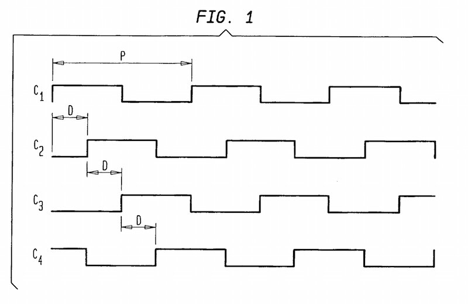

# Extreme phase shifting 101

_2015/03/17 Cecill Etheredge // ijsf_

---

As part of a high-tech hardware project I have been working on I have lately been diving into the area of clock signals. Now books have been written on the subject of clocks, clock distribution, clock skew, clock gating, and much more things involving the word 'clock', but my specific problem was a little unusual. Not surprising.

Imagine we have a system with a central processing unit (e.g. a microcontroller or FPGA) connected to 8 identical hardware devices. Each of these devices is connected by means of a data bus for I/O and more importantly, a clock signal (e.g. 10 MHz). Now imagine that, for whatever reason, the clocks of all 8 devices are to be equally phase shifted in relation to one another, dividing up the 360 degrees of total clock phase (360/8 = 45 degrees per device).

In other words, we have 8 devices with 10 Mhz clocks, the 1st clock has a phase shift of 0 degrees, the 2nd clock 45, 3rd 90, 4th 135, 5th 180, 6th 225, 7th 270 and 8th 315 degrees. Visually, it looks similar to the following figure which uses only 4 phase shifts:

The main question is, how do we solve this an easy, low-cost and straightforward way? It turns out there are different options one could use, depending on how you look at the problem and what your options are:

1.  _Are you trying to delay individual clock signals here?_ If so, why not use some kind of delay element or circuit?
2.  _Are you trying to phase shift individual clock signals here?_ If so, why not use some kind of clock control system such as a phase-locked loop (PLL)?

This is, of course, technically the same. But although even the end net result would theoretically be the same, the choice between the delay vs. phase shift definition matters a lot, as you will see below. In this first part, a brief exploration of some easy "delay" options:

## LC ladder networks

One way of going about it with delays is to apply 7 individual analog delays on an input clock. You would require a single 10 MHz line fanned out to 8 identical lines (e.g. using a buffer) and delay 9 lines using an analog delay element with increasing time delay. There are of course multiple ways to implement an analog delay element:

A basic passive LC circuit can be used to delay an input signal with a fixed amount of time. By varying the L and C constants, the time delay is changed. Rhombus has a [nice application note about these passive delay lines](http://www.rhombus-ind.com/dlcat/app1_pas.pdf). A circuit for a 2ns delay looks as follows:

Each LC circuit can be chained after one another, forming a ladder network, to multiply the time delay. For example, a 8ns chained delay looks looks very similar:

This way, 7 individual LC circuits could be composed with the appropriate time delays.

The advantage of LC ladder networks is that it is straightforward and easy. Unfortunately, inductors and capacitors have to be very low tolerance, as errors will accumulate in the circuit, and components will likely not be available in the initial L and C values you use for your calculation, requiring a lot of fiddling around with picofarads and nanohenries. In the end, it is usually not practical for these reasons alone.

## Copper delay lines

Signals can also be delayed by using long copper traces laid out on a PCB. Remember that each transmission line, whether it be a copper trace or a wire, has a propagation delay. This propagation delay is usually in nanoseconds when the traces become tens of centimeters long.

Good PCB layout software can provide an estimation of the propagation delay, but this also varies a bit based on the PCB dielectric used, the geometry of the trace and other things. I believe the rule of thumb is approximately 1 ns delay per 20 cm (or 8 inches). My own attempt at creating a PCB delay line test board resulted in the following design (note that the 409.60mm silkscreen should be 209.60mm):

Although I briefly measured the delay using a 4 GHz logic analyzer, the accuracy was a little off from the theoretical calculations. I soon gave up on the idea, because it will simply take up _a lot_ of space if you consider 7 delay lines in the tens of nanoseconds. Though the idea itself is very simple and cheap, it may work for other cases.
