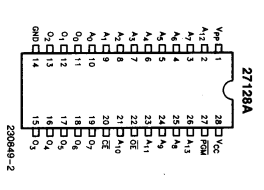

# Old school EPROM firmware dumping

_2015/07/09 Cecill Etheredge // ijsf_

---

Update: Check out the follow-up to this article, [Fixing firmware bugs from 1987 in 2017](20170102_fixing_firmware_bugs_from_1987_in_2017.html).

A few years ago, I managed to get hold of something I only barely knew as a Wersi MK1, an extremely rare West-German synth from 1986. The MK1 faded into obscurity due to its notoriously difficult interface, bad marketing and manufacturer bankruptcies. But in fact, it was one of the first incredibly well engineered digital wavetable synths in a world that was dominated by analog circuitry, and contained a whopping 20 Zilog CPUs to generate its sound.

**TL;DR:** Source code is available at [https://github.com/ijsf/lpc2148-eprom-reader](https://github.com/ijsf/lpc2148-eprom-reader)

In an effort to figure out how this beast works, I've been diving deep into the hardware schematics, and I've reached a point where firmware disassembly is necessary to figure out more about this incredible piece of hardware. Of course.. the firmware is safely locked in a chip that is more than 30 years old. Let's see.

## Getting to the chip

To get down to reverse engineering the software internals, it will be necessary to be able to access the contents of the firmware. These contents are generally stored in a programmable ROM type chip that can be found somewhere on the board.


The first step is to identify the firmware and corresponding chip. On the Wersi mainboard, it is marked as "PROGR. ROM" (Program ROM), and after lifting the DIP-socket chip it was pretty easy to identify both the chip and the engineer's scribbles on the paper marking that came of after 28 years of use.


As can be seen in the photo, the chip is an Intel D27256-3 with date code 1982, and the engineering comments read "MK1/EX20 IC3 630469W AF21 15.4.87", marking the firmware version AF21 likely produced on the 15th of April 1987. The actual version number of this firmware is V1.21, as the synth does mention this on bootup.

The Intel D27256-3 is a standard 27-series 256Kbit UV-Erasable PROM with around 200ns (5 MHz) access time, 15 address lines, 8 data lines, 2 enable lines and TTL-compatible signaling.

## What next?

Now, since I don't have an (E)EPROM programmer, I'll be forced to use whatever is on the shelf to extract the data from this piece of silicon. Perhaps more importantly is the fact that I want to be able to do patches to the synth's firmware, and as I do not have a programmer nor an EPROM eraser (these chips are reset to all-1's by certain UV light, hence the glass at the top), I'm left with few options.

Actually, the only "easy" way forward at this point is to build a fully compatible 27-series PROM emulator. A piece of hardware that sits in place of the EPROM chip on the board, and emulates its signaling. The Wersi mainboard uses 5V TTL signaling, abd sources have told me it does accept 3.3V on the lines (typically 2.0V volt minimum for HIGH bits) as well. Fortunately I have an unused LPC2148 board available that happens to output at 3.3V, but has 5V tolerant inputs, so that seems like a perfect fit. But first things first.. reading out that PROM.


## Getting the LPC2148 to work

The LPC2148 board is actually a quite nice tool to use for this purpose. It contains a USB subsystem and can thus be programmed to function as a USB serial console to dump out the firmware contents. Also, the Intel D27256 requires a supply voltage of 5V which the LPC2148 board can happily supply (remember USB is 5V, so yeah).

Without going into much detail, a little effort is required before I can use my LPC2148 setup, consisting of the LPC2148 board itself, a J-Link USB clone JTAG interface and a OS X host system. Long story short, you need the [gcc-arm-embedded launchpad](https://launchpad.net/gcc-arm-embedded/+download) toolchain, JTAG software [OpenOCD](http://sourceforge.net/projects/openocd/) and some boilerplate code from a [similar board](https://www.olimex.com/Products/ARM/NXP/LPC-P2148/).

Unfortunately, if you happen to have a cheap Chinese J-Link clone like me, OpenOCD may not work straight away since the J-Link clone tends to suffer from amnesia and errors out sometimes:

```
Error: JTAG scan chain interrogation failed: all zeroes
Error: Check JTAG interface, timings, target power, etc.
Error: Trying to use configured scan chain anyway...
Error: lpc2148.cpu: IR capture error; saw 0x00 not 0x01
Warn : Bypassing JTAG setup events due to errors
Info : Embedded ICE version 0
Error: unknown EmbeddedICE version (comms ctrl: 0x00000000)
```

Sources say that running the official Segger J-Link software beforehand solves this issue, although using non-authorized products may violate their EULA. Furthermore, this setup has a tendency to error out occasionally unless you follow a very strict order of things:

1.  Plug in J-Link USB connector
2.  Plug in LPC2148 USB connector
3.  Start J-Link software
4.  Start gdb, enter above commands (possibly doing load twice to avoid errors)
5.  Use gdb's \`continue\` command to start execution
6.  Unplug and replug LPC2148 USB connector (partially resetting the CPU)
7.  Perform debugging, recompilation, etc.
8.  Go to step 4.

## Interfacing the EPROM

The chip interfacing for the 27256-series is quite straightforward. Here is the pin layout for the similar 27128-series EPROM, which has a PGM (program enable) line instead of A14:



As can be seen, it is basically just a matter of connecting the address lines, data lines and signal lines to the 5V-tolerant I/O, and providing the supply voltage, which is done as follows:

*   Supply Vcc with 5V and attaching GND.
*   Connect address lines _A0_ to _A14_ to LPC2148 pins _P0.0_ to _P0.15_ (excluding _P0.14_ as this pin is reserved for bootloader stuff and may mess some things up). For 27128-series, the A14/PGM line should just be kept high at all time, which disables programming mode.
*   Connect data lines _Q0_ to _Q7_ to _P1.16_ to _P1.23_
*   Connect signal lines _CE_ (Chip Enable) to _P0.16_ and _OE_ (Output Enable) to _P0.17_.

This pin layout required some nasty fiddling, as some of the pins (e.g. around _P1.20_) are multiplexed with critical elements such as the JTAG subsystem, which can and will really mess things up. Additionally, all the appropriate LPC2148 registers need to be set accordingly and LPC's Fast GPIO functionality is preferred, as can be seen in the code.

The actual logic required for reading out the EPROM is quite straightforward, and involves setting the address lines, pulling _CE_ and _OE_ low, waiting, reading out the data lines, and pulling _CE_ and _OE_ back up. Since the EPROM has some specific timing requirements, the LPC2148's timer functionality is set up to provide a delay function for the required waiting time of ~200 ns after setting the address:

```
// eeprom read time in MHz, ensure this is an divisable integer of 60 (PCLK)
#define EPROM_READ_TIME 5

// set up TIMER0 to count on PCLK, which by now is set to 60 MHz
T0CTCR = 0x00;

// set the prescaler to the appropriate value
// e.g. our EPROM runs at 200 ns or 5 MHz, the prescaler (divider) is set to 12
T0PR = (60 / EPROM_READ_TIME) - 1;

// reset TIMER0
T0TCR = 0x02;
```

The actual logic driving the EPROM chip pretty much looks something like this:

```
static U8 eprom_read(U16 address)
{
  U8 data = 0;
  
  // set address line
  eprom_address_wr(address);
  
  // pull CE and OE down (in that particular order) to signal valid address and start our request
  eprom_ce_lo();
  eprom_oe_lo();
  
  // wait for the read time
  eprom_wait();
  
  // data should be ready, so read it out
  data = eprom_data_rd();
  
  // pull CE and OE up to signal invalid address and end our request
  eprom_ce_hi();
  eprom_oe_hi();
  
  return data;
}
```

## Setting up a USB serial link

Now that the EPROM interface is working, I need an easy and reliable way to dump the firmware contents back to the host machine. As mentioned before, the LPC2148 has a neat USB subsystem that can be put to use for this particular purpose. To start off, I based my code on the LPC2148-compatible [libusb](http://sourceforge.net/p/libusb/) which provides a nice little example that turns the LPC2148 into an echoing USB serial device.

It makes sense to use the USB serial example code and modify it to dump out the firmware contents, but only after a starting command is given over the serial line to avoid dumping before the host machine has its terminal attached:

```
// wait for USB serial console start character 'c'
do {
  c = VCOM_getchar();
} while(c != 'c');

...

// read out eprom
U16 i, eprom_size = 32768; // 256 Kbit
for(i = 0; i &lt; eprom_size; ++i)
{
  U8 data = eprom_read(i);
  while( VCOM_putchar(data) == EOF ); // retry until data is written to fifo
}
```

Pretty easy, right? Now I only need a little tool for the host machine that attached to the USB's tty interface, provided the start command ('c') and piped the 32768 bytes worth of data to a file. Perfect job for a Python script, which is also provided in the Github repository.

Then, everything came together and I managed to dump my 1987 firmware!


In retrospect, this entire journey took about half a day, 75% of which was spent setting up the toolchain and working out weird issues with the J-Link. Amazingly, once everything was hooked up and working, it all went pretty smooth from there.

