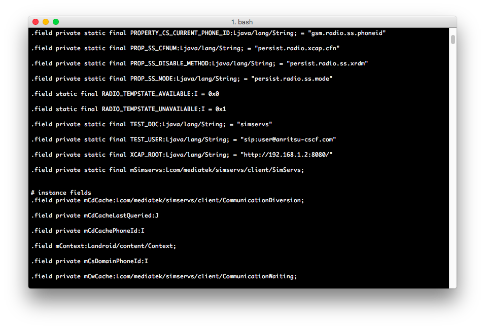

# Dissecting an Android ChinaPhone or hunting for spyware

_2016/09/22 Cecill Etheredge // ijsf_

---

For a while now, I've been on the lookout for a proper ruggedized Android phone that doesn't cost an arm and a leg. Since the low-end and counterfeit spectrum of Android phones seems to be dominated by Chinese MediaTek-based phones these days, and the turnaround time of new phone models is incredibly high over there, it made sense to scout the Chinese markets every once in a while to see what's new.

Up until about a week ago, my usual searches typically ended up with phones that were either way too expensive (can't risk too much money) or had poor/outdated specs (e.g. slow SoCs, no 3G/4G connectivity, poor screen resolution, little memory). Fortunately, this time around I did find one that seemed to suit me quite well, the Blackview BV6000s.

The [Blackview BV6000s](http://www.blackview.hk/blackview-153/) mentions a rating for IP-68, contains a fairly recent MT6735 SoC with 2 GiB of RAM, has support for Dual SIM along with some other good and redundant features and runs on Android 6.x. Though, what's especially nice is that Blackview maintains its own community forum that contains very recent [firmware updates](http://www.blackview.hk/blackview-153/), which seems to become more common these days for Chinese quality vendors.


That's it for the reviewing part, because there are more important things at hand. Following the infamous practice of "taking it apart before turning it on", I very much like to find out what my phone is doing while I'm (not) looking, so taking apart the firmware is almost mandatory, and in fact something I believe people should do more often in something as essential as a phone.

Public availability of firmware updates is great if you want to check out whether the stock ROM on the phone is clean, and if the vendor actually cares about its customers in terms of privacy and such. Since I like to know as much as possible about what's running on my phone, this is a great opportunity to take the firmware apart and figure out any hidden intentions. This shouldn't be taken too lightly, as some of my previous firmware dissections of Chinese (counterfeit) phones uncovered different types of preinstalled spy/malware.

## Tools to use

Let's start off with the tools to take apart a modern typical Android ROM firmware:

1.  **simg2img**, Android's simg2img tool that unpacks the ROM-supplied `system.img` file to a (loopback) mountable image, e.g. as available from [anestisb/android-simg2img](https://github.com/anestisb/android-simg2img) on Github.
2.  **ext4fuse**, to mount the unpacked `system.img`, which is typically EXT4 nowadays if you're using OS X.
3.  **apktool**, reverse engineering tool to unpack .apk files, available from [ibotpeaches/apktool](https://ibotpeaches.github.io/Apktool/) on Github.
4.  **smali/baksmali**, reverse engineering tools to decompile .odex/.dex files, available from [jesusfreke/smali](https://github.com/JesusFreke/smali) on Github.

These tools should provide enough to unpack the system image file, `system.img`, containing all the preloaded Dalvik/Android Runtime applications, and then to reverse engineer each of these. The idea here to figure out for each of these applications if they are original Android applications or whether they have been modified by the vendor for compatibility with the phone, or to possibly add malicious or data leaking code such as "phone home" functionality or ordinary phone spying.

## Image structure

As with most firmwares, the latest available firmware for the Blackview BV6000s is simply a ZIP file containing the various images, including the system image, along with some vendor-specific MediaTek flash configuration files. Mounting the `system.img` is therefore quite easy, as it is easily accessible and just needs to be unpacked and mounted:

```
$ ./simg2img system.img system.img_unpacked
$ ./mount -o loop system.img_unpacked /mnt
```

In case you're using OS X, you should use the `ext4fuse` command to mount the image instead. Doing a simple filename search for .apk and .odex extensions reveals a large collection of about 250 installed applications in the following directories:

```
/app
/framework
/priv-app
/vendor/operator/app
```

Prior to writing this article, I had already reverse engineered most of the applications in these folders, including those with unknown and suspicious filenames. Decompiling the .apk and .odex files is in fact quite easy:

```
$ apktool d -f -o apk FILENAME.apk
$ baksmali -x -c boot.oat -d /PATH/TO/framework oat/arm64/FILENAME.odex -o odex
```

The use of apktool will allow you to inspect the resources of the .apk file, typically the Android manifest (e.g. describing permissions), any images, localization strings and settings. In addition, the baksmali tool will decompile the Dalvik/Android Runtime bytecode into human-readable form for inspection of (a fairly rough form of) the inner workings of the applications themselves. This tool requires the presence of the `boot.oat` framework file, which is typically found in the `framework` directory of the system image. Furthermore, the smali/baksmali tools also allow you to recompile the app, in case you want to do any modifications such as removing unwanted code or constants.

## Searching for apps

To summarize the apps I found on the stock firmware, let's start with the Google apps and any optional non-essential apps that are typically preinstalled on Android phones:

```
./app/BasicDreams
./app/Exchange2
./app/FaceLock
./app/Galaxy4
./app/Gallery2
./app/GoogleCalendarSyncAdapter
./app/GoogleContactsSyncAdapter
./app/GoogleEars
./app/GoogleTTS
./app/HTMLViewer
./app/HoloSpiralWallpaper
./app/LiveWallpapers
./app/LiveWallpapersPicker
./app/Maps
./app/NoiseField
./app/PhaseBeam
./app/PhotoTable
./app/PicoTts
./app/PrebuiltGmail
./app/Videos
./priv-app/GoogleBackupTransport/GoogleBackupTransport
./priv-app/GoogleFeedback/GoogleFeedback
./priv-app/GoogleLoginService/GoogleLoginService
./priv-app/GoogleOneTimeInitializer/GoogleOneTimeInitializer
./priv-app/GooglePartnerSetup/GooglePartnerSetup
./priv-app/GoogleServicesFramework/GoogleServicesFramework
./priv-app/ManagedProvisioning/ManagedProvisioning
./priv-app/Phonesky/Phonesky
./priv-app/PrebuiltGmsCore/PrebuiltGmsCore
./priv-app/ProxyHandler/ProxyHandler
./priv-app/talkback/talkback
./priv-app/Velvet
```

In the above list, we can identify apps such as a few live wallpapers, all the usual Google services, along with Google apps such as Google Play (`Phonesky, PrebuiltGmsCore`), Google App (`Velvet`) and other obvious stuff. Needless to say, these have all been removed (including their libraries and any auxiliary files) in an attempt to get the most barebones stock firmware possible.

Next up are the MediaTek or vendor-specific applications, including any stock Android applications that have been modified. Let's start off with the apps that were either documented on the internet, or seemed non-essential just by looking at their name:

```
./app/AdupsFota                      (adups.cn Firmware-Over-The-Air service)
./app/AdupsFotaReboot                (adups.cn Firmware-Over-The-Air service)
./app/MiraVision                     (Helper app for MediaTek's MiraVision feature)
./app/MtkBrowser                     (Default browser as supplied by MediaTek)
./app/com.agold.compass              (Compass app)
./priv-app/AgoldWallPaper            (Wallpaper)
./vendor/operator/app/jks12_facebook (OEM Facebook app)
./vendor/operator/app/jks12_twitter  (OEM Twitter app)
./vendor/operator/app/jks12_xender   (OEM Xender app)
```

Again, these applications have been deemed non-essential, and have been removed from the firmware. The following list is more interesting:

```
./app/AgingTest
./app/Gba
./app/HetComm
./app/MTKLogger
./app/MtkCalendar
./app/MtkFloatMenu
./app/LocationEM2
./app/NlpService
./app/Omacp
./app/Uicc1Terminal
./app/Uicc2Terminal
./app/VoiceCommand
./app/YGPS
./app/agold.AgoldFactoryTest
./app/eSETerminal
./plugin/DataProtection
./plugin/FwkPlugin
./plugin/PermissionControl
./plugin/PrivacyProtectionLock
./priv-app/ImsService
./priv-app/Launcher3
./priv-app/MtkMms
```

For these applications, it was next to impossible to either find out what they are, what they're doing, or whether they had been modified by the vendor. After a long session of reverse engineering, I was able to document the exact functionality for each of these apps.



## Identifying apps

In the list below, non-essential applications have been marked in blue, (potentially) essential system applications have been marked in green, and (potentially) essential suspicious applications have been marked in red.

##### ./app/AgingTest — Phone "Aging Test" app

*   Requires a lot of permissions.
*   Seems to contain tests facilities for camera, vibrator, mic, speaker and video streaming.
*   No suspicious code in disassembly.
*   Non-essential.

##### ./app/HetComm — MediaTek Turbo downloader

*   Requires various permissions related to network, phone and settings.
*   Turbo downloader functionality combines 3G/4G and Wi-Fi to download files.
*   Also contains MediaTek HotKnot functionality, including a HotKnot server poller (port 19191).
*   No suspicious code in disassembly.
*   Non-essential.

##### ./app/MtkCalendar — Calendar

*   Requires a lot of permissions.
*   MediaTek fork of Google Calendar.
*   Contains a lot of `*.google.com` hosts, possibly leaking data.
*   Non-essential.

##### ./app/MtkQuickSearchBox — Quick search box

*   Requires a lot of permissions; makes sense for a search app.
*   MediaTek fork of Android quick search app.
*   This version extends the app by exposing some functions (probably to other MediaTek apps) and reads a MediaTek specific property `ro.mtk_owner_sim_support`.
*   Contains a lot of expected references to Google APIs.
*   Non-essential.

##### ./app/YGPS — GPS utility

*   Requires some location, internet, network permissions.
*   MediaTek fork of YunnanExplorer GPS utility, obviously based on utility app originally from [yunnanexplorer.com](http://www.yunnanexplorer.com/download/androidapps/).
*   No suspicious code in disassembly.
*   Non-essential.

##### ./plugin/PrivacyProtectionLock — MediaTek Privacy protection lock / anti-theft app

*   Requires many permissions; makes sense for a security app.
*   Can apparently be enabled through Settings.
*   Contains code to fingerprint all SIM cards in the device, generally stores a lot of data about any "trusted" SIM cards, and "untrusted" SIM cards in case the feature is enabled and the phone gets stoled and reused, in which case the feature locks the phone.
*   No suspicious code in disassembly.
*   Non-essential.

##### ./app/Gba — Mediatek Generic Bootstrapping Architecture service

*   Internet, phone state and boot permissions.
*   No suspicious code in disassembly.

##### ./app/MTKLogger — MediaTek System logger

*   Requires a lot of permissions, but makes sense for a logger service.
*   Contains MediaTek-specific device logging facilities.
*   No suspicious code in disassembly.

##### ./app/MtkFloatMenu — Menu UI component

*   Requires some permissions related to system alert and event injection.
*   MediaTek menu UI component as used by other MediaTek UI apps.
*   No suspicious code in disassembly.

##### ./app/NlpService — MediaTek Network Location Provider service

*   Requires some internet, location and boot permissions.
*   Starts a local socket server and communicates with LocationEm2.
*   No suspicious code in disassembly.

##### ./app/Omacp — MediaTek OMA Client Provisioning

*   Requires some vibrate, boot, network state, wake, phone permissions.
*   Consists of a receiver service, provider and app to support Open Mobile Alliance's WAP client provisioning.
*   No suspicious code in disassembly.

##### ./app/Uicc1Terminal — SIM Alliance UUIC terminal service

*   Requires phone state and system terminal permissions.
*   Provides a terminal to the SIM smart card.
*   No suspicious code in disassembly, identical to (open-source) OEM version.

##### ./app/Uicc2Terminal — SIM Alliance UUIC terminal service

*   Requires phone state and system terminal permissions.
*   Provides a terminal to the SIM smart card.
*   No suspicious code in disassembly, identical to (open-source) OEM version.

##### ./app/VoiceCommand — MediaTek voice command recognition service

*   Requires some storage, audio, contacts, boot, MediaTek permissions.
*   Quite elaborate implementation of phone-wide voice commands.
*   No suspicious code in disassembly.

##### ./app/agold.AgoldFactoryTest — Mediatek Factory test tool

*   Requires a lot of permissions; makes sense for a factory test tool.
*   No suspicious code in disassembly.

##### ./app/eSETerminal — SIM Alliance Terminal service

*   Requires system terminal and NFC permissions.
*   No suspicious code in disassembly, identical to (open-source) OEM version.

##### ./plugin/DataProtection — Mediatek Data protection service

*   Requires various permissions and filters related to storage, documents, user management.
*   This data protection service can apparently be enabled in Settings.
*   No suspicious code in disassembly.

##### ./plugin/PermissionControl — MediaTek Permission control service

*   Requires permission related permissions :)
*   Uses a number of MediaTek specific properties such as `ro.mtk_op01_rcs` and `ro.build.characteristics` and implements MediaTek specific Android permissions for apps (e.g. `ACCESS_MTK_MMHW`).
*   No suspicious code in disassembly.

##### ./priv-app/Launcher3 — Mediatek fork of Android Launcher

*   Requires many permissions.
*   No suspicious code in disassembly.

##### ./plugin/FwkPlugin — Mediatek plugin system

*   Requires no permissions.
*   The nature of this plugin system is somewhat obscure, this particular app just looks like a plugin manager related to embedded media functionality in other apps.
*   No suspicious code in disassembly.

##### ./priv-app/ImsService — Mediatek IMS service

*   Requires some phone related permissions.
*   Contains some Chinese user credentials (`sip:user@anritsu-cscf.com`, `user@chinaTel.com`) and IP addresses (`192.168.1.2`) in `./com/mediatek/ims/MMTelSSTransport`. However, these appear to be test credentials that have been left in.
*   No suspicious code in disassembly.

##### ./priv-app/MtkMms — MediaTek MMS service

*   Requires many permissions.
*   This MMS service implements MediaTek-specific dual SIM support, and may in fact be the default messaging app on the system.
*   Contains an advertisement (default invite message string) for `isms.hissage.com`. App appears to be based off "Hissage iSMS".

##### ./app/LocationEM2 — MediaTek Location manager

*   Requires many permissions related to network, phone, location.
*   Communicates with NlpService to provide location services to the operating system.
*   Contains localhost IP address (`127.0.0.1`), unknown IP address (`221.176.0.55`) and the usual Google AGPS host (`supl.google.com`) in com/mediatek/lbs/em2/ui/LbsMisc. `221.176.0.55` appears to be a China Mobile AGPS server as an alternative to `supl.google.com`.
*   Some versions of this app [have been known to leak GPS data + IMEI information](http://mobilesociety.typepad.com/mobile_life/2014/08/supl-reveals-my-identity-and-location-to-google.html) to these AGPL servers, though this version does not appear to leak any IMEI/IMSI or phone specific data.

## Conclusion

To summarize, all non-essential apps were removed from the system image and all other apps have been left in place, as I did not manage to find any malicious code thus far, and I highly doubt I will find any at all (unfortunately). The level of bloatware on this phone is also very acceptable.

If a vendor does have malicious intent, it is most likely that any malicious code would be added at this level of the system, e.g. in any preloaded system apps that come installed on the stock firmware, since these apps normally cannot be removed. Though, a much more sophisticated attempt at preloading spy/malware would involve infecting lower level system files such as binary shared object libraries, system daemons, or even the drivers or baseband processor. The most obvious way of finding malicious agents on this level would be to monitor all in- and outgoing traffic on packet or even radio level.

However, given the transparency and surprisingly good community support of this particular Chinese vendor, the absence of counterfeit branding, along with the relatively very clean stock installation thus far just makes it all the more unlikely that spy/malware is present on this device at any level.

Too bad, but better luck next time!
