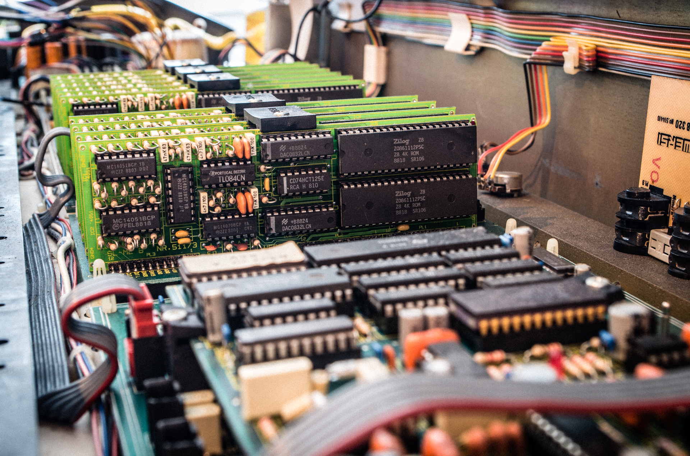
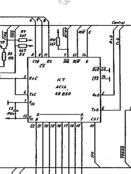
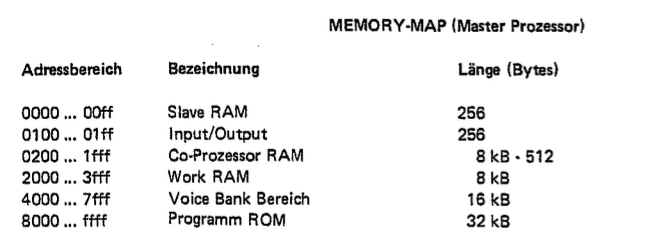
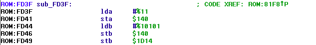
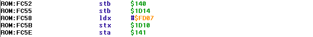
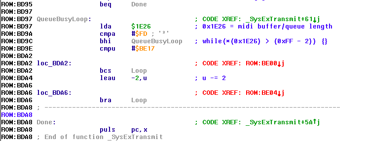
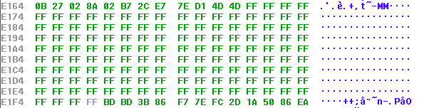
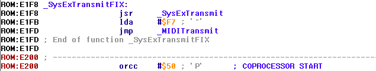
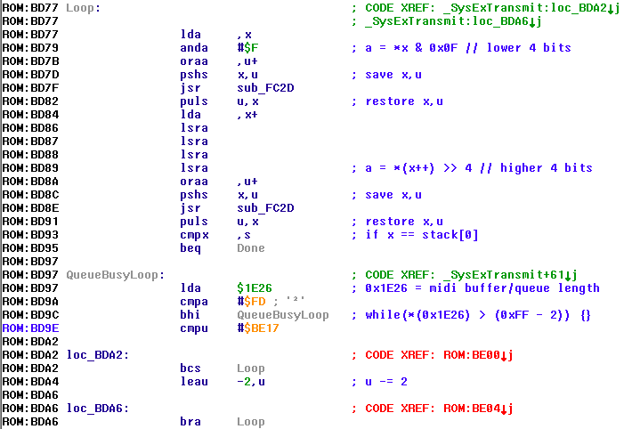
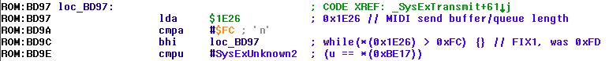

# Fixing firmware bugs from 1987 in 2017

_2017/01/02 Cecill Etheredge // ijsf

---

A few years ago, I managed to get hold of something I only barely knew as a Wersi MK1, an extremely rare West-German synth from 1986. In my [last article](/old-school-eprom-firmware-dumping/), I managed to get ahold of the firmware contents. In this article, I'll be diving into the actual firmware to.. fix some ancient bugs!

Why? Well, due to a revived interest in these synths from some people around the globe, I'm currently in the process of developing a modern web-based editor companion tool for this synth, capable of communicating with this big old chunk of 80's hardware over MIDI. My editor actually provides full sound programming capability for this synth (at last!), even more so than the convoluted buttons on the synth itself, thanks to the presence of an obscure SysEx programming implementation in its firmware.

Now, reverse engineering of this SysEx implementation has been an off-and-on side project for a while now. Long story short, after getting ahold of the original German technical manuals, schematics, and getting into contact with some friendly engineers, the MK1's SysEx protocol slowly unraveled, and the editor finally progressed into something quite powerful.

One thing that was bothering me during development was the extreme unreliability of the SysEx messages: they would often come back incomplete, missing one or two bytes, or not at all. I initially blamed this on my MIDI interface, but I was eventually told that this was in fact a MIDI firmware bug that was never fixed. Nevertheless, this really needed to be fixed sooner or later.

So here we go.. fixing ur bugs, 29 years ahead!

Background
----------

Let's first start off with a little background on the Wersi MK1's internals - as available from [wer.si](http://wer.si).



This synthesizer is quite modular, in the sense that it contains up to 10 slave boards with two _Zilog Z8611_ (Z8 architecture) CPUs that take care of sound generation, all while the rest is driven by two _Motorola 68B09_ CPUs. These CPUs are hooked up to a multitude of RAM buses, connecting all CPUs with four RAM ICs for a total of 32 KiB of shared segmented RAM. All in all, this 1986 synthesizer contains up to a whopping 22 CMOS CPUs!

In any case, our MIDI code is contained somewhere in the 32 KiB ROM that we previously dumped, and needs to be patched up to spec.

So let's start with the actual problem, by looking at the raw data behind the Wersi SysEx protocol, as per the manual:

```
F0 25 01 7_ 6_ 5_ 4_ 3_ 2_ 1_ 0_ .. .. F7
          │  │  │  │  │  │  │  │
          │  │  │  │  │  │  │  └─ [data] (hi)
          │  │  │  │  │  │  └──── [data] (lo)
          │  │  │  │  │  └─────── size (hi)
          │  │  │  │  └────────── size (lo)
          │  │  │  └───────────── address (hi)
          │  │  └──────────────── address (lo)
          │  └─────────────────── identifier (hi)
          └────────────────────── identifier (lo)
```

The above format is used for both requests and responses. The `F0` and `F7` are MIDI industry-standard SysEx indicators, and the start byte is followed by a vendor identification - `25` claimed by Wersi - and a vendor-specific model identification. From thereon, data is encoded using 4-bit nibbles, with the higher 4 bits indicating the type of data, and the lower 4 bits containing the actual data. SysEx messages are typically call and response, and data is not present whenever a request is made.

The above protocol encapsulates all SysEx messages and structures all synthesizer functionality in so called "blocks". Each block exists to control a specific type of functionality, such as the VCF filters, wavetables, envelopes interface buttons, and so on, often in combination with a block "address" that maps more or less directly to the voice presets as stored in RAM. For instance, the VCF filter for the first user preset is typically accessible with a `'v'` ASCII character block identifier, `0x41` block address, a predetermined block size of `10` bytes.

Unfortunately, that's the ideal implementation, and as it turns out, things aren't quite ideal.

In reality, the `0xF7` End-Of-Exclusive (EOX) byte is omitted, leading to guaranteed data corruption on the receiving end. The upside though, is that in order to fix this.. all we theoretically need to do is to craft some 6809 assembly to add that `0xF7` byte!

## Searching the ROM

As you'll be able to see in my Wersi firmware repository at [github.com/ijsf/wersi-mk1-ex20-re](https://github.com/ijsf/wersi-mk1-ex20-re/tree/master/firmwares), there are a number of different incompatible firmware versions out there, and the idea is to patch up the most recent versions to get SysEx working again. Here I'll be working with my own V1.21 firmware version.

We'll use [IDA](https://www.hex-rays.com/products/ida/) as our main reverse engineering tool, as it contains the 6809 instruction set that allows us to actually disassemble the ROM and get started. In our case, we position the ROM in the `0x8000` to `0xFFFF` address space, according to the technical manual and let IDA start its static analysis.

The hunt for the actual SysEx code is quite a forensic affair. Somewhere with the 32 KiB address space, probably only a few dozens of instructions are responsible for the SysEx transmissions. We have no entry point, and IDA's static analysis leaves us with a lot of dead ends and unknowns. A little digging in the technical manual gives us the first clue:



The MIDI signals are in fact hooked up to a 1988 _Motorola 68B50 Asynchronous Communication Interface Adapter (ACIA)_, which obviously must be capable of communicating using a MIDI-compatible UART bus. A second clue is found a little further ahead in the manual:



What this tells us is that we should be looking for typical load/store instructions within an address range of `0x0100` to `0x01FF`, as these will talk directly to the ACIA chip, and thus to our MIDI bus. A quick glance in the ACIA datasheet also tells us that it is controlled through an 8-bit control register, and enters a "Master Reset" mode whenever `0x03` is written to that register. This is interesting, because we can expect a reset to be done somewhere on bootup.

Searching through our disassembled haystack of instructions, we stumble upon the following:



Two consecutive stores to `0x0140`, within our range, and with values `0x03` and `0x15`. A check with the ACIA datasheet reveals that this is code is initiating a Master Reset, followed by a mode selection of 8 data bits + 1 stop bit, as per MIDI specification. Looks a lot like a MIDI initialization subroutine to me!

We find another subroutine directly above that seems to deal with the actual MIDI data transmission by using address `0x0141` which is likely to be the transmit register:



Cross referencing this subroutine and seeing where this subroutine is called, we indeed find another subroutine that seems to send our `F0 25 01` SysEx header! Here it is:


And sure enough, we stumble upon the source of our problem when looking at the end of this subroutine:



Oops.. no `0xF7` transmitted at all? Well, let's assume they just forgot to implement that little crucial detail. The only thing we would have to do is add that `0xF7` at the end, right? :)

## Patching the ROM

Truth be told, this can be quite tricky.

All this code was assembled back in 1987 and quite obviously crammed into 32 KiB. Now, the quickest patches are usually done by changing instructions or operands, in place, making sure not to disturb anything else. In this case, we are missing a bunch of instructions that obviously need to be there, except there is no room at all in the vicinity of this particular subroutine to add them back in.

A solution to this particular situation is is to create a small "wrapper" subroutine that actually calls our SysEx transmit subroutine, and sends the `0xF7` after the original subroutine returns. We then change all pointers to the original SysEx transmit subroutine to our new wrapper. These wrappers are typically placed in an empty or unused region, which we conveniently find at the following location:



This should provide more than enough space to put our new wrapper subroutine, and we can be pretty sure this is an used region because `0xE200` happens to be the start of the _Motorola 68B09_ coprocessor code range.

The wrapper itself consists of a `JSR` (jump to subroutine), `LDA` to load the `0xF7` byte as argument for the MIDI transmit subroutine which we finally jump into with a `JMP`. A simple 6809 assembler is used to patch the relevant bytes into the firmware at `0xE1F8`:



All pointers to the original SysEx transmit subroutine at `0xBD3B` are then changed accordingly. In fact, this only ends up to be a single pointer at `0xBDF5` that needs to be patched.

At this point, these patches are looking quite good indeed! Time to pack up, patch in, flash an EEPROM and try?

Hold on though. It is easy to overlook some crucial things, like the original engineers did, if you don't bother to do a deeper analysis of the subroutines involved in this whole SysEx transmission, and find out the hard way that your patch crashes the entire machine for some reason.

Let's look at how the core of the SysEx transmit subroutine actually works:



This big bunch of code takes care of looping over a given array of 8-bit data, splitting each 8-bit word into two 4-bit nibbles and sending them over MIDI according to the SysEx protocol. Note that the CPU operates at a far higher rate than the ACIA can send its data over MIDI, and memory is very scarce in this machine, so it is expected that some kind of slower rate buffer exists that is going to be full in certain situations.

In the above code, a busy loop can be seen that continually checks a value at `0x1E26`. It is quite obvious that this indicates the remaining space of the transmit buffer, with `0xFF` representing a totally full buffer, which we can expect to slowly decrement as the bytes are sent out.

Since the SysEx transmit subroutine will send 2 bytes at once, it is crucial to check that the buffer has at least space for 2 more bytes before invoking the MIDI transmit subroutine, and this is how we end up with the `0xFD` value. Any value above that, and data loss and subsequent corruption would occur.

Recall though that our new wrapper sends another single `0xF7` EOX byte after this subroutine is done. Leaving the `0xFD` value intact would again lead to a likely loss of the EOX byte!

The easiest way to deal with this is to just patch the busy loop value down to `0xFC` so there is always space for 3 more bytes: the 2 that are sent by the original subroutine, and the EOX byte sent by our wrapper:



## Conclusion

Thumbs up. At this point, we should have pretty much taken care of the SysEx data corruption problem. To recap: the CPU is now guaranteed to send the EOX byte for our SysEx block transmissions, of course assuming they are all handled within the function that we found. We now also know that the transmit buffer has enough space to accommodate this extra crucial byte.

The only thing to do now is to flash it into an EEPROM and plug into the MK1 synthesizer!

Let me just say that this fix works as expected with the editor and indeed solves any factory born data corruption, so be sure to get your fix at [github.com/ijsf/wersi-mk1-ex20-re](https://github.com/ijsf/wersi-mk1-ex20-re/tree/master/firmwares) if you own one of these great synthesizers.. at least if you want to use my upcoming editor somewhere in the future :)

Happy hacking!
