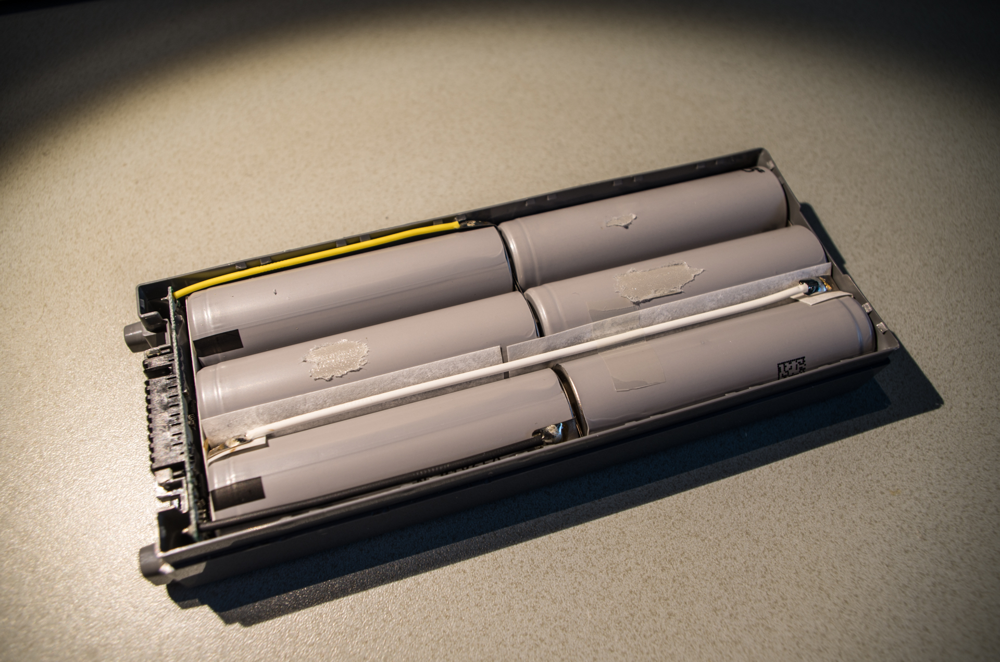

# From scrap batteries to MagSafe power bank

_2017/08/02 Cecill Etheredge // ijsf_

---

_Update: Check out the follow-up to this article, [From batteries to MagSafe power bank 2.0](20180427_from_batteries_to_magsafe_power_bank_2_0.md)._

Cleaning up a bunch of stuff in my house, I stumbled upon a unused battery pack for a laptop that gets so little use it's on permanent AC power.

Faced with the chore of having to dispose of these properly, I opted to open it up instead, ignoring the friendly messages on the label that warn of fire, explosion and other injuries when doing so.

Opening up this battery pack proved quite difficult. The plastic was secured with a good amount of clips and extremely sticky adhesive tape was used to secure everything for obvious reasons. Nevertheless, the internals are quite neat, as you would expect from a brand like Panasonic. The pack contains 6 Japanese NCR18650 batteries and an OEM management and connector board.

Seeing these cells, it occurred to me that these packs are so much more standard than my 2013 era Macbook's battery pack, which I have had to replace on multiple occasions. As a matter of fact, it sadly reminded me of the inability to swap out battery packs. I figured I might as well attempt to repurpose these cells to work around that particular problem, and turn these cells into a Macbook compatible power bank, for what its worth.

Because MacBooks have few external connectors (even less so today), the idea is to hook the batteries up to a MagSafe connector and emulate an Apple charger. Keep in mind that a "charger" typically supplies enough power to both "charge" the internal batteries and power the entire machine whilst doing so, which is fine when the charger is AC powered. But with a battery powered charger, you really want to avoid charging internal batteries at all.

If anything, some mechanism is required to let the Macbook use the power bank as a DC source, bypassing its own battery so that it doesn't drain but it doesn't charge using the DC source either. One option would be to somehow disconnect the internal battery, but that's going pretty far. Fortunately, the MagSafe adapter has a quite neat "feature" we can exploit.

The MagSafe connector itself consists of 5 mirrored pogo pins, a microcontroller and a LED. All power pins pass directly to the adapter. The center pin acts as a 1-wire bus between the Macbook and the MagSafe microcontroller, passing power state information and signaling an OK signal to the Macbook charging circuit after handshaking. If the 1-wire is absent, the OK signal is omitted and charging circuit will not be activated, but any available DC power will always be used to power the MacBook. The solution is as simple as can be:

By masking the center pin with kapton tape, all our charging problems are solved :)

## MagSafe connector

Official MagSafe adapters come in about 4 versions with different voltage and power ratings, ranging from 14.5 V (45 W) up to 20V (85 W), though all are backwards compatible with less power hungry Macbooks. This suggests that the DC-in on these MacBooks accepts a wide range of voltages. We can verify this by looking at the relevant schematics:

To the left is the internal DC power input connector as seen from the Macbook's logic board, with pins 1/2 at DC and 4/5/6 at GND. Capacitors on the DC line are rated 35V and 50V. Looking further ahead, we find the power management IC responsible for the DC conversion to internal voltages:

The IC used here is the LT3470A, a Linear Technology buck regulator that accepts a voltage range of 4 to 40 V. However, the power capacitors going to ground seem to suggest an absolute maximum voltage of 25 V. Looking at other parts of the schematics, some more 25 V rated ICs and passive components can be found.

Given the absolute maximum and the factory maximum of 20 V for the most expensive MagSafe adapter, I get to pick a configuration for the 18650 cells that comes as close as possible. Since I only have 6 cells, hooking 6 up in series would yield a nominal voltage of 22.2 V, a little too close to the absolute maximum for my taste. However, with 5 cells in series, I get up to a comfortable nominal voltage of 18.5 V.

## Battery pack

While all of this takes care of the discharging side of the battery pack, it also needs the ability to be charged. Assuming a Li-ion charge voltage of 4.2 V per cell, we need at least 21 V to charge the batteries. And as is standard practice for battery packs, a protection PCB must also be included to avoid dangerous discharge or overcharge events, and a management feature must be available to properly charge individual cells to their respective voltages.

At this point, the bill of materials to finish up the power bank isn't that spectacular, if it ever was:

*   5x 18650 cells, in 5S or 5-series configuration.
*   5S Li-ion battery management PCB (~$3 on eBay).
*   5S LED charge indicator PCB (~$3 on eBay).
*   MagSafe cable (~$3 on eBay).
*   \>21 V DC adapter (found at the local dump store).
*   DC female jack.
*   Miscellaneous materials (soldering, packaging).

Having received all materials a few good weeks later, I decided to hook everything up for a prototype charging test.

Charging this setup, I noticed that despite these cells being brand new they did appear to be quite discharged. Full charge at 18.5 V was eventually achieved but took quite a while due to the low power rating of the adapter I found at the dump store, but that should be fine.

Next step was to connect a DC jack for easy charging access and wrap everything up in a bunch of heavy duty heat shrink and kapton tape. Voltages were double checked and some fingers were crossed before it was finally hooked up to the real thing. An unwieldy battery explosion prevention bag was never far away in case things got bad, and well, if all else failed my window was open and close by too.

Surprised by the lack of green light on the MagSafe adapter, it occurred to me that this had been disabled with the center pin hack. I checked the charging state in OS X: it was on AC power but not charging!

Going by the original Panasonic specifications, this rogue power bank should give about 3000 mAh or a few good hours of power for not too much money, and hopefully no injuries provided they won't catch fire.

Granted, packed up like this I wonder if this will get me through an airport any time soon. Do not try this at home!
