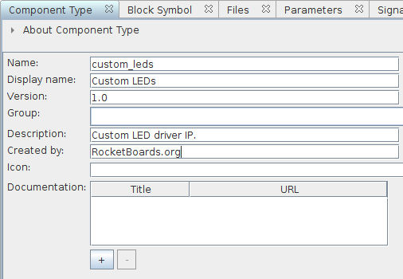
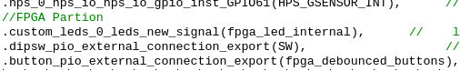

# Building embedded Linux for the Terasic DE10-Nano (and other Cyclone V SoC FPGAs)

_2017/08/20 Oguz Meteer // guztech_

---

A little while ago, I bought a Terasic DE10-Nano FPGA development board. Of course I wanted to do some cool things with it, and a friend of mine found this [nice embedded Linux beginners guide](https://rocketboards.org/foswiki/Documentation/EmbeddedLinuxBeginnerSGuide). The guide goes from using a Golden Hardware Reference Design (GHRD) and adding a custom IP, to developing a Linux kernel driver to use the custom IP. While some steps are explained in a lot of detail, other steps are a bit lacking because they expect the reader to have experience with how to create a Qsys component and such. That, combined with the fact that some pieces of software used in the guide are pretty old now, I have decided to create a step by step guide on building your own, fairly up-to-date embedded Linux and custom hardware with a kernel driver.

I will not go into details on subjects where [the guide at RocketBoards.org](https://rocketboards.org/foswiki/Documentation/EmbeddedLinuxBeginnerSGuide) already explain it very well. If you want to know more about a specific step, check their guide for more information. Also, I have marked important sections with "**Attention:**".

Let's get started!

Step 0 - Preparation
====================


So you bought a Terasic DE10-Nano (or a similar Cyclone V SoC FPGA development board). Where do you first start? By installing the necessary tools of course. There are two pieces of software you need to download and install to follow this guide:

1.  [**Quartus Prime**](https://www.altera.com/products/design-software/fpga-design/quartus-prime/download.html) - This is the software suite that you use to create hardware designs. Any version will be sufficient, so I picked the **Lite** version which is free.
2.  [**Intel SoC FPGA Embedded Development Suite (EDS)**](http://dl.altera.com/soceds/) - This software suite is used to develop software that will run on the ARM core(s) of the Cyclone V SoC. Again, any version will work and I downloaded the **Standard** edition.

The latest version of both software suites is 17.0 as of this writing. Quartus Prime also has a small update which you can download separately, or you can download a fully updated version. I did not have any version of Quartus Prime installed yet, so I downloaded the fully updated version.

**Attention:** I use Arch Linux, so some steps might be a little different if you are using Windows.

### Step 0.1 - Installing Quartus Prime

First you need to install Quartus Prime. If you downloaded the Lite version, it will install in a folder called **intelFPGA\_lite**, and the other versions will install in a folder called **intelFPGA**. Keep that in mind as you will need it in the next step.

### Step 0.2 - Installing SoC EDS

Next you need to install SoC EDS in the same folder as where you installed Quartus Prime. By default, the installer will install in a folder called **intelFPGA**. So if you installed Quartus Prime Lite, then you will need to modify this to **intelFPGA\_lite**. If you installed the Standard or Pro editions of Quartus Prime, then you do not need to modify anything.

### Step 0.3 - Setting the MSEL switches

There are many ways that the Cyclone V SoC can be configured, and they can be selected using the MSEL switches. By default, the switches are set to On, Off, On, Off, On, On for switches 1 to 6 respectively.

**Attention:** for this guide they should **all be on**. If they are not all on, then the in later steps, the FPGA will not get programmed.

Step 1 - Creating and modifying the hardware design
===================================================

Manufacturers of FPGA development boards usually supply reference designs so that users can get their boards up and running quickly. With Intel/Altera boards these are called the Golden Hardware Reference Design (GHRD). We will use a GHRD to create our own hardware design.

### Step 1.1 - Getting the GHRD

Terasic, the manufacturer of the DE10-Nano board, also supplies GHRDs for their boards. For the DE10-Nano, you can download the "[DE10-Nano CD-ROM](http://www.terasic.com.tw/cgi-bin/page/archive.pl?Language=English&CategoryNo=205&No=1046&PartNo=4)" (aka SystemCD) that contains everything you need. If you have a different board with the Cyclone V SoC, then download the CD-ROM image for your board.

After you have downloaded the SystemCD zip file and extracted it, you can find several reference designs in the **_Demonstrations_** folder. The GHRD that we will use in this guide is located in **_Demonstrations/SoC\_FPGA/DE10\_NANO\_SoC\_GHRD_**. Once you are done with this guide and get everything up and running, I suggest you also play around with the other GHRDs.

Let's take a look inside the **_DE10\_NANO\_SoC\_GHRD_** folder:


### Step 1.2 - Upgrading IP

Start up Quartus Prime and open the **_soc\_system.qpf_** project file. In the top left corner of the Quartus window, you will be greeted with this:


This GHRD was created with Quartus Prime version 16 whereas in this guide, I am using version 17. Click the **_Launch IP Upgrade Tool_** button, and this window will appear:  


You can safely ignore the warning and click the _**Perform Automatic Upgrade**_ button. After a little while, all of the used IP in the design will have been upgraded to latest version. Close the Upgrade Tool window.

### Step 1.3 - Modifying the GHRD

We will modify the GHRD using the Qsys tool, which can be started from within Quartus Prime (**Tools → Qsys**). Once Qsys has started, open the **_soc\_system.qsys_** project file. This is the hardware reference design that we will modify:


Like in the [guide at Rocketboards.org](https://rocketboards.org/foswiki/Documentation/EmbeddedLinuxBeginnerSGuide#2), we will remove the **led\_pio** IP and add our own custom IP. Right click on **led\_pio** IP and click **Remove**.

### Step 1.4 - Creating a custom IP

Adding custom hardware to a hardware design is a two step process. First we describe the custom IP using a hardware description language (HDL) such as VHDL and (System) Verilog, and then we create a Qsys component so that we can add our custom IP to the hardware design. Here we will use the same IP "code" that is used in the [Rocketboards.org guide](https://rocketboards.org/foswiki/Documentation/EmbeddedLinuxBeginnerSGuide#2). This custom IP is an Avalon Memory Mapped Slave that acts as a GPIO peripheral. The output of this IP will be connected to the LEDs on our DE10-Nano so that we can modify which LEDs light up from Linux running on the ARM cores.

Create a folder **_custom\_leds_** in **_DE10\_NANO\_SoC\_GHRD/ip/_**, and create a file **_custom\_leds.sv_** in the newly created **_DE10\_NANO\_SoC\_GHRD/ip/custom\_leds/_** folder. Copy and paste the following code in the **_custom\_leds.sv_** file:

```
module custom_leds
(
    input  logic        clk,                // clock.clk
    input  logic        reset,              // reset.reset
    
    // Memory mapped read/write slave interface
    input  logic        avs_s0_address,     // avs_s0.address
    input  logic        avs_s0_read,        // avs_s0.read
    input  logic        avs_s0_write,       // avs_s0.write
    output logic [31:0] avs_s0_readdata,    // avs_s0.readdata
    input  logic [31:0] avs_s0_writedata,   // avs_s0.writedata
    
    // The LED outputs
    output logic [7:0]  leds
);

// Read operations performed on the Avalon-MM Slave interface
always_comb begin
    if (avs_s0_read) begin
        case (avs_s0_address)
            1'b0    : avs_s0_readdata = {24'b0, leds};
            default : avs_s0_readdata = 'x;
        endcase
    end else begin
        avs_s0_readdata = 'x;
    end
end

// Write operations performed on the Avalon-MM Slave interface
always_ff @ (posedge clk) begin
    if (reset) begin
        leds <= '0;
    end else if (avs_s0_write) begin
        case (avs_s0_address)
            1'b0    : leds <= avs_s0_writedata;
            default : leds <= leds;
        endcase
    end
end

endmodule // custom_leds
```

### Step 1.5 - Creating a custom component

In order to use our **_custom\_leds_** IP in Qsys, we need to create a Qsys component (**File → New Component**). This will open the **_Component Editor_**. In the **_Component Type_** tab we can enter information about the IP that we are creating. I entered the following information:

*   Name: **_custom\_leds_**
*   Display name_:_ **Custom LEDs**
*   Description: **_Custom LED driver IP._**
*   Created by: **_RocketBoards.org_**



Next, we go to the **_Files_** tab, and under the **_Synthesis Files_** section, we add our **_custom\_leds.sv_** file so that Qsys and Quartus Prime know which hardware description to use when our component is being synthesized:


_Normally_, you can click the **_Analyze Synthesis Files_** button so that the editor can find the signals of your IP and add them to the component automatically. However, Qsys cannot analyze SystemVerilog files (which is the language used in the Rocketboards guide), so we have to do this step by hand. If your IP is described in VHDL or Verilog, then you could simply add the signals with a click of a button.

Go to the **_Signals & Interfaces_** tab, click on **_<<add interface>>_**, and select **_Clock Input_**. Change the name of the clock interface from _**clock\_sink**_ to **_clock_**:


Click on **_<<add signal>>_** below our newly define clock interface, and select **_clk_**. Change the name of the signal from **_clock\_clk_** to **_clk_**:


We rename the interface and especially the signals to make sure that they are the same as in our IP description. If we did not rename them, then we would have to change the IP description signal names.

Next up we will add the reset signal to our component. Click on **_<<add interface>>_** and select **_Reset Input_**. Rename the interface from **_reset\_sink_** to **_reset_**. Now click **_<<add signal>>_** and select **_reset_**. Rename the reset signal from **_reset\_reset_** to **_reset_**:


Now that we have defined the clock and reset signals of our component, we will define the Avalon Memory Mapped Slave interface and its associated signals. Click on **_<<add interface>>_** and select **_Avalon Memory Mapped Slave_**. Change the name of the interface from **_avalon\_slave_** to **_avs\_s0_**. Set **_Associated Clock_** to **_clock_**, and **_Associated Reset_** to **_reset_**.

Now add the following signals to the **_avs\_s0_** interface:

*   Type: **address** - Name: **avs\_s0\_address** - Width: **1** - Direction: **input**
*   Type: **read** - Name: **avs\_s0\_read** - Width: **1** - Direction: **input**
*   Type: **write** - Name: **avs\_s0\_write** - Width: **1** - Direction: input
*   Type: **readdata** - Name: **avs\_s0\_readdata** - Width: **32** - Direction: **output**
*   Type: **writedata** - Name: **avs\_s0\_writedata** - Width: **32** - Direction: **input**

This should result in:


The last interface and signal that we have to add is for the **_leds_** output of our IP. Click **_<<add interface>>_** and select **_Conduit_**. Rename the interface from **_conduit\_end_** to **_leds_**. Again, make sure that the associated clock and reset are set to **_clock_** and **_reset_** respectively. Finally click **_<<add signal>>_**, select **_\*_**, and name the signal **_leds_**. Set the signal width to _**8**_ and make it an **_output_**. You should end up with this:


Make sure that the **_Messages_** section at the bottom does not report any errors, and click **_Finish_** to create our custom IP. A new window will appear, and you should answer it with **_Yes, Save_**:


There is one final step to creating our custom component. Later on, when preparing to configure and compile the Linux kernel, we will generate a **_Device Tree_** which tells the kernel what kind of hardware is present in our system. This can be used by the kernel to load drivers for example. To make sure that our custom component is correctly added to the **_Device Tree_**, we have to modify the **_custom\_leds\_hw.tcl_** file that Qsys generates when we saved our changes just now.

Open up the **_DE10\_NANO\_SoC\_GHRD/custom\_leds\_hw.tcl_** file and append the following to it:

```
# Device tree generation
set_module_assignment embeddedsw.dts.vendor "dsa"
set_module_assignment embeddedsw.dts.compatible "dev,custom-leds"
set_module_assignment embeddedsw.dts.group "leds"
```

Remember this part, since we will be referring to it in step 4 of this guide.

### Step 1.6 - Adding the custom component to the hardware design

To add our custom component to the hardware design, double click on **_Custom LEDs_** under **Project** in the **_IP Catalog_** tag, and click **_Finish_** in the window that appears:


Now that we have added the custom component to our hardware design, we need to connect it to the rest of the system. Click on the four white empty dots marked with a red circle to connect the Avalon, clock, and reset interfaces:


The final step is to make a connection for the **_leds_** conduit output of our component. Right click on **_leds_** of our **_custom\_leds\_0_** instance, and select **Connections: custom\_leds\_0.leds → Export as: custom\_leds\_0\_leds**. This exports the **_leds_** output of our custom component as an external signal, not connected to the rest of the components of our hardware design. This makes sense, since we want to connect it to the LEDs on our board.

### Step 1.7 - Generating HDL

First, save the hardware design in Qsys (Ctrl-S). Now it's time to generate the HDL that describes the hardware design we created in Qsys. This generated HDL output will be used by Quartus Prime to actually synthesize the design, and create a **_bitstream_** which we can use to program the FPGA.

To do this, click on **Generate → Generate HDL** in Qsys_._ Click on **_Generate_** in the window that appears, and when the generation process is finished, click **_Close_**. Since we are done with Qsys, we can now close it.

### Step 1.8 - Preparing synthesis

Go back to Quartus Prime, and double click on **_DE10\_NANO\_SoC\_GHRD_** in the **_Project Navigator_**. This will open up the top-level file that describes our entire hardware design. We need to make a few changes because we removed the **led\_pio** component and replaced with our own component.

In our top-level file called **_DE10\_NANO\_SoC\_GHRD.v_** file, search for **led\_pio\_external\_connection\_export** and replace it with our own exported signal **_custom\_leds\_0\_leds\_new\_signal_**. So we go from this:


to this:



The final change is required because Qsys apparently instantiates our custom component incorrectly. Our component is named **_custom\_leds_** but Qsys thinks it is **_new\_component_**. In the **_Project Navigator_**, change **_Hierarchy_** to **_Files_**, and open the file **_soc\_system/synthesis/soc\_system.v_**:


Search for "**_new\_component"_**:


And replace it with "_**custom\_leds"**:_


### Step 1.9 - Synthesizing the system

We can finally synthesize the system and generate a bitstream. In Quartus, in the left panel, double click on **_Assembler (Generate programming files)_**. This process should be done in about 5-10 minutes depending on your computer. When it's done, we need to create a **_Raw Binary File_**. Click on **File → Convert Programming Files**, and follow these steps:

1.  For **_Programming file type_** select **_Raw Binary File (.rbf)_**.
2.  For **_Mode_** select **_Passive Parallel x16_**.
3.  For **_File name_**, name the output file **_soc\_system.rbf_**.
4.  In the **_Input files to convert_** section, click on _SOF Data_, and click on the **_Add File_** button on the right. Select the **_output\_file/DE10\_NANO\_SoC\_GHRD.sof_** file.


Click on **_Generate_** to generate the **_soc\_system.rbf_** file. And with this, we are done with the hardware part of this guide.

Step 2 - Generating the preloader
=================================

Open up a terminal and execute **_embedded\_command\_shell.sh_** in your SoC EDS installation folder, which by default is **_~/intelFPGA\_lite/17.0/embedded/_** if you installed everything in the same folder as I recommended in steps 0.1 and 0.2 at the beginning of this guide. After executing that shell script, you now have access to several tools of SoC EDS which we will need in this and coming steps.

In your terminal, go to your **_DE10\_NANO\_SoC\_GHRD_** folder and execute:

```
bsp-editor &
```

which will open up the **_BSP Editor_**. Clicking on **File →New HPS BSP** opens up the following window:


We have to select the correct **_Preloader settings directory_** by clicking on the _"**..**"_ button next to it and selecting the **_DE10\_NANO\_SoC\_GHRD/hps\_isw\_handoff/soc\_system\_hps\_0/_** folder. The rest of the settings will get filled in for you, so just click **_OK_**:


### Step 2.1 - Configuring the preloader

In the left panel, click on **_Common_**, and enable **_FAT\_SUPPORT_** as shown in the screenshot below:


That is the only change we had to make, so click **_Generate_** button in the bottom right of the BSP Editor window. When it's done, click **Exit**.

### Step 2.2 - Compiling the preloader

The generated output of the BSP Editor can be found in the **_DE10\_NANO\_SoC\_GHRD/software/spl\_bsp/_** folder. Also generated is a **Makefile** that we can use to compile the preloader. In your terminal, type:

```
cd software/spl_bsp; make
```

And that is it for the preloader!

Step 3 - Setting up U-Boot
==========================

The next step is setting up U-Boot which is responsible for several things such as loading the bitstream into the FPGA and booting the Linux kernel. Assuming you are in the **_DE10\_NANO\_SoC\_GHRD/software/_****_spl\_bsp/_** folder, go back to the _**DE10\_NANO\_SoC\_GHRD/software/**_ folder:

```
cd ..
```

### Step 3.1 - Getting and setting up the GCC toolchain

To compile U-Boot and the Linux kernel, we need a GCC toolchain for the ARMv7 instruction set. You can probably download one with your package manager, but since this step is different for each Linux distribution, we will simply download a toolchain from Linaro. While, as of this writing, the newest version of the Linaro GCC toolchain is **7.1.1-2017.05**, it unfortunately throws errors when compiling the version of U-Boot that we will be using, which is somewhat old. So we will use the newest version that compiles U-Boot correctly, and that is version _**6.3.1-2017.05**_ as of this writing. We will download the latest GCC 6.x version and unpack it in the **_DE10\_NANO\_SoC\_GHRD/software/_** folder:

```
wget https://releases.linaro.org/components/toolchain/binaries/latest-6/arm-linux-gnueabihf/gcc-linaro-6.3.1-2017.05-x86_64_arm-linux-gnueabihf.tar.xz
tar -xvf gcc-linaro-6.3.1-2017.05-x86_64_arm-linux-gnueabihf.tar.xz
```

(You can also go to that link in the snippet above, download it and extract it manually as well if you do not want to use the terminal)

Next we have to set the **_CROSS\_COMPILE_** environment variable to point to our newly extracted GCC toolchain:

```
export CROSS_COMPILE=$PWD/gcc-linaro-6.3.1-2017.05-x86_64_arm-linux-gnueabihf/bin/arm-linux-gnueabihf-
```

**_Attention_**: if you close the terminal after setting the **_CROSS\_COMPILE_** environment variable, you have to set it again! To do that, just go to the **_DE10\_NANO\_SoC\_GHRD/software/_** folder and execute the code snippet above.

### Step 3.2 - Getting and compiling U-Boot

Altera/Intel have their [own version of U-Boot](https://github.com/altera-opensource/u-boot-socfpga) on the [Altera opensource GitHub repository](https://github.com/altera-opensource), which is modified to run specifically on their FPGAs. Let's clone their repository:

```
git clone https://github.com/altera-opensource/u-boot-socfpga.git
cd u-boot-socfpga
```

We want to make sure that we do not use the code from the master branch that could potentially have bugs, so we will use the latest stable release version. To find all versions that Altera has released:

```
git tag -l rel_socfpga*
```

As of this writing that is **_rel\_socfpga\_v2013.01.01\_17.08.01\_pr_**, so that is the version that we will use:

```
git checkout rel_socfpga_v2013.01.01_17.08.01_pr
```

To make sure that we start with a clean slate before compiling, we will clean the U-Boot folder:

```
make mrproper
```

And then we will compile U-Boot:

```
make socfpga_cyclone5_config
make
cd ..
```

This produces the **_u-boot.img_** U-Boot image file in the same folder.

### Step 3.3 - Setting up the boot script

U-Boot needs a boot script to know how to setup the FPGA and load the Linux kernel. Create a file named **_boot.script_** in the **_DE10\_NANO\_SoC\_GHRD/software/_** folder with the following contents:

```
echo -- Programming FPGA --
fatload mmc 0:1 $fpgadata soc_system.rbf;
fpga load 0 $fpgadata $filesize;
run bridge_enable_handoff;

echo -- Setting Env Variables --
setenv fdtimage soc_system.dtb;
setenv mmcroot /dev/mmcblk0p2;
setenv mmcload 'mmc rescan;${mmcloadcmd} mmc 0:${mmcloadpart} ${loadaddr} ${bootimage};${mmcloadcmd} mmc 0:${mmcloadpart} ${fdtaddr} ${fdtimage};';
setenv mmcboot 'setenv bootargs console=ttyS0,115200 root=${mmcroot} rw rootwait; bootz ${loadaddr} - ${fdtaddr}';

run mmcload;
run mmcboot;
```

Read the [Rocketboard.org guide](https://rocketboards.org/foswiki/Documentation/EmbeddedLinuxBeginnerSGuide#5) for more information on what this boot script does. Now that we have a boot script, we need to compile it so that U-Boot can use it:

```
mkimage -A arm -O linux -T script -C none -a 0 -e 0 -n "Boot Script Name" -d boot.script u-boot.scr
```

That creates the compiled boot script file **_u-boot.scr_**, and with that, we are done with U-Boot!

Step 4 - Generating and compiling the device tree
=================================================

This guide will not into detail what the device tree is and what it is used for, because the [guide at Rocketboards.org](https://rocketboards.org/foswiki/Documentation/EmbeddedLinuxBeginnerSGuide#6) does an excellent job explaining it. The SoC EDS tool that we installed contains an application called **_sopc2dts_** that takes a **_.sopcinfo_** file and optional _**.xml**_ board files, and generates a **_.dts_** file, which is the source version of our device tree. If we did not have this tool, then we would have to create a **_.dts_** file by hand which can be very tedious. There are two **_.xml_** board files that are in the GHRD: **_hps\_common\_board\_info.xml_** and **_soc\_system\_board.info.xml_**. These files are for external peripherals that you can connect to the HPS (ARM cores) part of the system, but since Qsys does not know about peripherals that lie outside the FPGA fabric, they are described in those two _**.xml**_ board files. The **_hps\_common\_board\_info.xml_** file contains pointers to the **_led\_pio_** component that we removed and replaced with the **_custom\_leds_** component in steps 1.3 and 1.4 respectively, so we have to modify it for the **_sopc2dts_** application to generate a correct and valid **_.dts_** file.

Open up **_hps\_common\_board\_info.xml_** and replace all "_**led\_pio**_" with "**_custom\_leds\_0_**" (which is the name of our instantiated _**custom\_leds**_ component as you can see in the image in step 1.6). We now have to compile this _**.dts**_ file to obtain a _**.dtb**_ binary device tree file. To do all of this, execute the following in the same terminal you have been using up till now (if you did everything correctly, you should still be in the _**DE10\_NANO\_SoC\_GHRD/software/**_ folder before executing the following snippet):

```
cd ..
sopc2dts --input soc_system.sopcinfo --output soc_system.dts --type dts --board soc_system_board_info.xml --board hps_common_board_info.xml --bridge-removal all --clocks
```

This generates the _**.dts**_ file. Execute the following to compile it:

```
dtc -I dts -O dtb -o soc_system.dtb soc_system.dts
```

Do you remember that at the end of step 1.5 we added several lines to the **_DE10\_NANO\_SoC\_GHRD/custom\_leds\_hw.tcl_** file? This is what we added back then:

```
# Device tree generation
set_module_assignment embeddedsw.dts.vendor "dsa"
set_module_assignment embeddedsw.dts.compatible "dev,custom-leds"
set_module_assignment embeddedsw.dts.group "leds"
```

Because we did that, the **_.dts_** file now contains the following section:

```
custom_leds_0: leds@0x100000000 {
  compatible = "dsa,custom_leds-1.0", "dev,custom-leds";
  reg = <0x00000001 0x00000000 0x00000008>;
  clocks = <&clk_0>;
}; //end leds@0x100000000 (custom_leds_0)
```

If we had not added it back then, we would have had to add it manually to our _**.dts**_ file each time we made a change to our system. So remember to add the module assignment commands to the **_.tcl_** file of each component you create, so that you do not have to remember to add it manually every time you build a new system.

Step 5 - Testing the system
===========================

We are now at a point where we are able to test if we did everything correctly up till this point by preparing an micro SD card with the preloader, U-Boot, the raw bitstream file, and the compiled device tree file on it. We will create an image file on the computer, create three partitions on it, copy the files to the image, and then copy the image to an actual micro SD card. Pay close attention to the commands because when used incorrectly, you can wipe out your host system.

### Step 5.1 - Creating an image file and mounting it

First we create a 512 MiB file on our computer that will be our image (you should be in the _**DE10\_NANO\_SoC\_GHRD**_ folder if you followed the guide correctly):

```
sudo dd if=/dev/zero of=sdcard.img bs=512M count=1
```

We will mount this file as if it was an actual disk so that we can use the usual tools to manipulate disks:

```
sudo losetup --show -f sdcard.img
```

The output of this command is the name of the loopback device that we can use to manipulate the image file. On my machine, the output is:

```
/dev/loop0
```

On your machine it may be something else, so remember what it is, because we will need it in the next step.

### Step 5.2 - Creating partitions

We will be using fdisk to create three partitions: a FAT partition of 256 MiB, the root file system of type ext4 and size 254 MiB, and a 1 MiB partition of type A2 (Altera custom). This leaves 1 MiB of free space that will be used by the Master Boot Record. Let's start fdisk so that we can create these partitions (remember to replace **_/dev/loop0_** with wherever the SD card image was mounted on your system):

```
sudo fdisk /dev/loop0

Welcome to fdisk (util-linux 2.30.1).
Changes will remain in memory only, until you decide to write them.
Be careful before using the write command.

Device does not contain a recognized partition table.
Created a new DOS disklabel with disk identifier 0xf3236d5b.

Command (m for help):
```

We can view the current partitions on a device with the "**_p_**" command. In our case, we have a new device so there should be no partitions. Verify this by typing **_p_** and **_Enter_**:

```
Command (m for help): p
Disk /dev/loop0: 512 MiB, 536870912 bytes, 1048576 sectors
Units: sectors of 1 * 512 = 512 bytes
Sector size (logical/physical): 512 bytes / 512 bytes
I/O size (minimum/optimal): 512 bytes / 512 bytes
Disklabel type: dos
Disk identifier: 0xf3236d5b

Command (m for help):
```

First we will create the A2 (Altera custom) partition with a size of 1 MiB with the "**_n_**" (new) command. It will be a **_primary_** partition with partition number **_3_**, **_default first sector_**, and a size of **_1 MiB_**. This can be done by entering the following commands:

```
Command (m for help): n
Partition type
   p   primary (0 primary, 0 extended, 4 free)
   e   extended (container for logical partitions)
Select (default p): p
Partition number (1-4, default 1): 3
First sector (2048-1048575, default 2048): 
Last sector, +sectors or +size{K,M,G,T,P} (2048-1048575, default 1048575): +1M

Created a new partition 3 of type 'Linux' and of size 1 MiB.
```

So we enter "n", "p", "3", \*blank\*, and "+1M". fdisk tells us that it created a new partition 3 of type 'Linux' of size 1 MiB. As we can see, the type is 'Linux' which is the default partition type, and we have to change it to A2 (Altera custom). Changing the type of a partition can be done with the "_**t**_" command:

```
Command (m for help): t
Selected partition 3
Hex code (type L to list all codes): a2
Changed type of partition 'Linux' to 'unknown'.
```

Next up is the root file system, which is also a _**primary**_ partition with partition number **_2_**, _**default first sector of 4096**_, and a size of **_254 MiB_**:

```
Command (m for help): n
Partition type
   p   primary (1 primary, 0 extended, 3 free)
   e   extended (container for logical partitions)
Select (default p): p
Partition number (1,2,4, default 1): 2
First sector (4096-1048575, default 4096): 
Last sector, +sectors or +size{K,M,G,T,P} (4096-1048575, default 1048575): +254M

Created a new partition 2 of type 'Linux' and of size 254 MiB.
```

The type is again 'Linux' which is correct so we do not have to change it. Finally, we will create the **_256 MiB_**, **_primary_** partition of type **_FAT_** with partition number **_1_**, and _**default first and last sectors**_:

```
Command (m for help): n
Partition type
   p   primary (2 primary, 0 extended, 2 free)
   e   extended (container for logical partitions)
Select (default p): p
Partition number (1,4, default 1): 1
First sector (524288-1048575, default 524288): 
Last sector, +sectors or +size{K,M,G,T,P} (524288-1048575, default 1048575): 

Created a new partition 1 of type 'Linux' and of size 256 MiB.
```

We will change the type of partition **_1_** to **_FAT_**:

```
Command (m for help): t
Partition number (1-3, default 3): 1
Hex code (type L to list all codes): b

Changed type of partition 'Linux' to 'W95 FAT32'.
```

Verify that all partitions were created correctly:

```
Command (m for help): p
Disk /dev/loop0: 512 MiB, 536870912 bytes, 1048576 sectors
Units: sectors of 1 * 512 = 512 bytes
Sector size (logical/physical): 512 bytes / 512 bytes
I/O size (minimum/optimal): 512 bytes / 512 bytes
Disklabel type: dos
Disk identifier: 0xf3236d5b

Device       Boot  Start     End Sectors  Size Id Type
/dev/loop0p1      524288 1048575  524288  256M  b W95 FAT32
/dev/loop0p2        4096  524287  520192  254M 83 Linux
/dev/loop0p3        2048    4095    2048    1M a2 unknown

Partition table entries are not in disk order.
```

Finally, we will write the changes we have made to the "device" with the "**_w_**" command:

```
Command (m for help): w
The partition table has been altered.
Calling ioctl() to re-read partition table.
Re-reading the partition table failed.: Invalid argument

The kernel still uses the old table. The new table will be used at the next reboot or after you run partprobe(8) or kpartx(8).
```

As we can see, re-reading the partition table has failed which means the our host system is not aware of the new partitions that we just added to our mounted loop device. We can fix this with _**partprobe**_ command (remember to replace **_/dev/loop0_** with wherever the SD card image was mounted on your system):

```
sudo partprobe /dev/loop0
```

Verify that the our host system now knows about the three partitions we created:

```
ls /dev/loop0*
/dev/loop0  /dev/loop0p1  /dev/loop0p2  /dev/loop0p3
```

As you might have guessed, **_/dev/loop0p1_**, **_/dev/loop0p2_**, and **_/dev/loop0p3_** correspond to the three partitions we created.

### Step 5.3 - Creating the file systems

Now that we have the partitions setup, we need to create the appropriate file systems on the partitions, and copy over the files that we generated in previous steps. First off is the preloader image that will be copied to the _**A2**_ partition which is partition number _**3**_ (remember to replace **_/dev/loop0_** with wherever the SD card image was mounted on your system):

```
sudo dd if=software/spl_bsp/preloader-mkpimage.bin of=/dev/loop0p3 bs=64k seek=0
```

We did not create a file system for the _**A2**_ partition since the **_A2_** partition type is a raw partition and the preloader is a raw binary file. However, both the _**FAT**_, and _**ext4**_ root file system partitions require file systems to be created though. Create both file systems using the following two commands:

```
sudo mkfs -t vfat /dev/loop0p1
sudo mkfs.ext4 /dev/loop0p2
```

The files required to boot the Cyclone 5 SoC need to be copied to the _**FAT**_ partition, so first we need to mount it:

```
mkdir temp_mount
sudo mount /dev/loop0p1 temp_mount/
```

Copy the U-Boot image, compiled boot script, device tree binary, and the FPGA raw bitstream files to the newly mounted partition:

```
sudo cp software/u-boot-socfpga/u-boot.img software/u-boot.scr soc_system.dtb soc_system.rbf temp_mount/
```

Finally, make sure that all files have been actually copied to the partition, and then unmount the **_FAT_** partition:

```
sync
sudo umount temp_mount
```

### Step 5.4 - Write the SD card image to an actual SD card

Find out which device is your SD card by executing _**lsblk**_:

```
lsblk

NAME        MAJ:MIN RM   SIZE RO TYPE MOUNTPOINT
loop0         7:0    0   512M  0 loop 
├─loop0p1   259:5    0   256M  0 loop 
├─loop0p2   259:6    0   254M  0 loop 
└─loop0p3   259:7    0     1M  0 loop 
mmcblk0     179:0    0   7.4G  0 disk
nvme0n1     259:0    0 238.5G  0 disk 
├─nvme0n1p1 259:1    0   200M  0 part /boot/efi
├─nvme0n1p2 259:2    0   256M  0 part /boot
├─nvme0n1p3 259:3    0 230.3G  0 part /
└─nvme0n1p4 259:4    0   7.8G  0 part [SWAP]
```

The SD card in the SD card reader in my computer is the mmcblk0 device, so to write the SD card image file that we prepared to the SD card, execute the following:

```
sudo dd if=sdcard.img of=/dev/mmcblk0 bs=2048
sync
```

Once this is done, you can unmount the SD card and plug it into the DE10-Nano board.

### Step 5.5 - Testing the system

Find out which device is the USB UART that is connected to the UART port of the DE10-Nano:

```
ls /dev/ttyUSB*
/dev/ttyUSB0
```

Then use your favorite terminal emulator (like _minicom_) and connect to the DE10-Nano:

```
sudo minicom -D /dev/ttyUSB0
```

Now plug in the power to the DE10-Nano and you should see something like this:

```
U-Boot SPL 2013.01.01 (Aug 10 2017 - 09:30:00)
BOARD : Altera SOCFPGA Cyclone V Board
CLOCK: EOSC1 clock 25000 KHz
CLOCK: EOSC2 clock 25000 KHz
CLOCK: F2S_SDR_REF clock 0 KHz
CLOCK: F2S_PER_REF clock 0 KHz
CLOCK: MPU clock 800 MHz
CLOCK: DDR clock 400 MHz
CLOCK: UART clock 100000 KHz
CLOCK: MMC clock 50000 KHz
CLOCK: QSPI clock 3125 KHz
RESET: COLD
INFO : Watchdog enabled
SDRAM: Initializing MMR registers
SDRAM: Calibrating PHY
SEQ.C: Preparing to start memory calibration
SEQ.C: CALIBRATION PASSED
SDRAM: 1024 MiB
ALTERA DWMMC: 0
reading u-boot.img
reading u-boot.img


U-Boot 2013.01.01-00138-g239ae4dbaa (Aug 10 2017 - 16:25:41)

CPU   : Altera SOCFPGA Platform
BOARD : Altera SOCFPGA Cyclone V Board
I2C:   ready
DRAM:  1 GiB
MMC:   ALTERA DWMMC: 0
*** Warning - bad CRC, using default environment

In:    serial
Out:   serial
Err:   serial
Skipped ethaddr assignment due to invalid EMAC address in EEPROM
Net:   mii0
Warning: failed to set MAC address

Hit any key to stop autoboot:  0 
reading u-boot.scr
587 bytes read in 5 ms (114.3 KiB/s)
## Executing script at 02000000
-- Programming FPGA --
reading soc_system.rbf
7007204 bytes read in 631 ms (10.6 MiB/s)
## Starting application at 0x3FF7957C ...
## Application terminated, rc = 0x0
-- Setting Env Variables --
reading zImage
** Unable to read file zImage **
reading soc_system.dtb
24275 bytes read in 8 ms (2.9 MiB/s)
Bad Linux ARM zImage magic!
reading zImage
** Unable to read file zImage **
reading soc_system.dtb
24275 bytes read in 9 ms (2.6 MiB/s)
Bad Linux ARM zImage magic!
SOCFPGA_CYCLONE5 #
```

We can see that the Preloader sets up the clocks to different peripherals on the board, enables SDRAM, and then starts U-Boot. U-Boot then will read the raw bitstream file and load it into the FPGA. You can verify if the bitstream was loaded correctly by looking at the LEDs on the board. There should be one blinking LED. U-Boot also reads the device tree file, and finally also tries to read the Linux kernel (zImage), but it cannot find it. This of course makes sense, since we have not compiled it yet, so let's do that now.

Step 6 - Configuring and compiling the Linux kernel
===================================================

Before preparing the Linux kernel, I want to note that we used the latest GCC 6.x version to compile U-Boot. We can also use the same version to compile the rest of the software which are the Linux kernel and Buildroot, but we can also use the latest version of the Linaro GCC 7.x toolchain to compile them. If you want to use GCC 6.x then you skip the guide to step 6.2, and if you want to use GCC 7.x then continue with the next step.

### Step 6.1 - Getting and setting up the GCC 7.x toolchain

Follow this step if you want to use the latest version of GCC (7.x as of this writing) to compile the rest of the software. We will again use the Linaro GCC toolchain. If you followed the guide up till this point, you should be in the _**DE10\_NANO\_SoC\_GHRD/**_ folder, so in your terminal that you should still have open, execute the following:

```
cd software
wget https://releases.linaro.org/components/toolchain/binaries/7.1-2017.05/arm-linux-gnueabihf/gcc-linaro-7.1.1-2017.05-x86_64_arm-linux-gnueabihf.tar.xz
tar -xvf gcc-linaro-7.1.1-2017.05-x86_64_arm-linux-gnueabihf.tar.xz
export CROSS_COMPILE=$PWD/gcc-linaro-7.1.1-2017.05-x86_64_arm-linux-gnueabihf/bin/arm-linux-gnueabihf-
```

This should look familiar to you by now. Do not forget to export the _**CROSS\_COMPILE**_ environment variable if you happen to close the terminal.

### Step 6.2 - Getting the Linux kernel source code

Make sure that you are in the _**DE10\_NANO\_SoC\_GHRD/software/**_ folder. Altera has a fork of the [Linux kernel on their Github](https://github.com/altera-opensource/linux-socfpga), so let's get it from there: A reader told me that the fork on Github does not contain the versions used for this tutorial anymore. I have uploaded a local copy to Gitlab:

```
git clone https://gitlab.com/GuzTech/linux_socfpga.git
cd linux_socfpga
```

To find all the versions that are available:

```
git tag -l rel_socfpga*
```

As of this writing, the newest version is **_rel\_socfpga\_4.11\_17.08.02\_pr_**, so that is the version that we will be using:

```
git checkout rel_socfpga-4.11_17.08.02_pr
```

### Step 6.3 - Configuring the Linux kernel

I have mentioned this a couple of time before, but make sure that the _**CROSS\_COMPILE**_ environment variable has been set and is pointing to the correct version of the GCC toolchain, because we cannot configure nor compile the Linux kernel if is is not set. First let's create a default configuration:

```
make ARCH=arm socfpga_defconfig
```

We are now ready to configure the Linux kernel:

```
make ARCH=arm menuconfig
```

You should be greeted with the following:


There are many options that you can modify and they lie outside the scope of this guide. For more information about an option, just enter "_**?**_" when hovering over that option. Although the default settings are pretty much ok, we still need to make two changes.

First go to _**General setup**_ and uncheck **_Automatically append version information to the version string_** option. Whenever the kernel loads a module, it checks if the version the module is the same as the kernel version, and rejects loading if they differ. If we uncheck this option, it makes development easier since we can test different versions of drivers. For production systems, leaving this option checked is recommended though.

The second change we will make can be found in _**Enable the block layer**_ and is called _**Support for large (2TB+) block devices and files**_. This option should be turned on, and is needed if we want to use ext4 file systems with full read/write support. If this option is disabled, then we can only mount ext4 file systems in read-only mode. Press _**ESC**_ until you are back on the main page, and press the right arrow key until you have selected _**Save**_, and then press _**Enter**_ to save these settings. The default filename "_**.config**_" is fine, so select **_Ok_** to save our settings. We are done, so select _**Exit**_.


### Step 6.4 - Compiling the kernel

To compile the kernel just execute the following:

```
make ARCH=arm LOCALVERSION= zImage
```

Once this is done, we will have a `zImage` file which is a compressed Linux kernel image.

Step 7 - Generating a root file system
======================================

As I have mentioned several times before, the [guide at RocketBoards.org](https://rocketboards.org/foswiki/Documentation/EmbeddedLinuxBeginnerSGuide#9) has much more background information on what the Linux kernel expects from a root file system, so definitely check it out. We will use Buildroot, which is a collection of tools that automate the process of creating a root file system and all the necessary system applications. Since we were in the **_DE10\_NANO\_SoC\_GHRD/software/__linux\_socfpga/_** folder, execute the following:

```
cd ..
git clone git://git.buildroot.net/buildroot
cd buildroot
```

Search the tags to find all versions:

```
git tag -l
..
..
2017.05
2017.05-rc1
2017.05-rc2
2017.05-rc3
2017.05.1
2017.05.2
2017.08-rc1
2017.08-rc2
```

Normally, I use the latest stable version which is **_2017.05.2_** as of this writing. However, if you are using GCC 7.1.1, then you need a newer version (**_2017.08-rc2_** as of this writing). So depending on the version of the compiler you decided to use, check one of them out:

```
git checkout 2017.05.2
cd ..
```

or

```
git checkout 2017.08-rc2
cd ..
```

### Step 7.1 - Configuring Buildroot

The command to configure Buildroot requires the path to the GCC toolchain that we downloaded before. Depending on whether you chose to use GCC 6.3.1 or 7.1.1, execute the following:

```
make -C buildroot ARCH=ARM BR2_TOOLCHAIN_EXTERNAL_PATH=$(pwd)/gcc-linaro-6.3.1-2017.05-x86_64_arm-linux-gnueabihf nconfig
```

or

```
make -C buildroot ARCH=ARM BR2_TOOLCHAIN_EXTERNAL_PATH=$(pwd)/gcc-linaro-7.1.1-2017.05-x86_64_arm-linux-gnueabihf nconfig
```

You should be greeted with the following:


Here is a list of changes we need to make under **_Target options_**:

*   Target Architecture: _**ARM (little endian)**_
*   Target Architecture Variant: **_cortex-A9_**
*   Enable NEON SIMD extension support (NEW)**_: Enable_**
*   Enable VFP extension support (NEW): _**Enable**_
*   Target ABI: _**EABIhf**_
*   Floating point strategy: _**NEON**_


Next up is the _**Toolchain**_ section. For GCC version, select the version that you are using, and kernel headers series should be _**4.6.x**_ and _**4.10.x**_ for GCC version _**6.3.1**_ and _**7.1.1**_ respectively. Since I'm using GCC 7.1.1, I have configured it like this:

*   Toolchain type: **_External toolchain_**
*   Toolchain: _**Custom toolchain**_
*   Toolchain prefix: **_arm-linux-gnueabihf_**
*   External toolchain gcc version: _**7.x**_
*   External toolchain kernel headers series: _**4.10.x**_
*   External toolchain C library: **_glibc/eglibc_**
*   Copy gdb server to the Target (NEW): **_Enable_**


While these are the only necessary changes, there are still a ton of options that you can adjust if you want to. Perhaps the most important is to change the root password (_**System configuration →Root password**_). You can also let Buildroot add all kinds of extra applications to you root file system. I will stick with the default settings in this guide. To save the configuration, press _**F6**_ and _**Enter**_ to accept the default file name. Press _**F9**_ to exit the application.

### Step 7.2 - Configuring BusyBox

Before we move on, we need to configure BusyBox. In order to do that, we need to make sure that we have the _**cpio**_ and _**rsync**_ packages installed on our host system. Then execute:

```
make -C buildroot busybox-menuconfig
```

You will be greeted with the following:


Luckily, the default settings are ok, so simply go to _**Exit**_. It will ask you if you want to save your new configuration, and since we do want to do that, answer _**Yes**_.

### Step 7.3 - Generating the root file system

There is one last command that we have to execute to generate the root file system. Depending on which version of GCC you are using:

```
make -C buildroot ARCH=ARM BR2_TOOLCHAIN_EXTERNAL_PATH=$(pwd)/gcc-linaro-6.3.1-2017.05-x86_64_arm-linux-gnueabihf all
```

or

```
make -C buildroot ARCH=ARM BR2_TOOLCHAIN_EXTERNAL_PATH=$(pwd)/gcc-linaro-7.1.1-2017.05-x86_64_arm-linux-gnueabihf all
```

Step 8 - Testing the system again
=================================

We are ready to copy everything over to the SD card again. Remember that we have three partitions on the SD card that we prepared before:

*   256MB FAT
*   254MB ext4
*   1MB Altera custom

The 1MB partition will not be modified anymore, so only the first two partitions need our attention. When you plug in the SD card, we need to know where the **_FAT_** and _**ext4**_ partitions are mounted. To find this, you can use the **_lsblk_** command like we did before in step 5.4. Now that we know where the two partitions have been mounted, we will first copy over the Linux kernel to the _**256MB FAT**_ partition which should contain the _**soc\_system.dtb**_, _**soc\_system.rbf**_, _**u-boot.img**_, and _**u-boot.scr**_ files:

```
sudo cp linux_socfpga/arch/arm/boot/zImage <mount point of the 256MB FAT partition>
```

And finally, we copy over the root file system to the _**254MB ext4**_ partition and wait for it finish copying to the SD card:

```
sudo tar -xvf buildroot/output/image/rootfs.tar -C <mount point of the 254MB ext4 partition>
sync
```

Unmount the partitions and unplug the SD card, and plug it in the DE10-Nano board. When you power up the board, you should see Linux starting up and show you a login prompt. You can login as root with a blank password. If you configured a root password during the Buildroot configuration step, then of course use that password.

```
[    1.206393] Waiting for root device /dev/mmcblk0p2...
[    1.300426] mmc_host mmc0: Bus speed (slot 0) = 50000000Hz (slot req 50000000Hz, actual 50000000HZ div = 0)
[    1.310192] mmc0: new high speed SDHC card at address e624
[    1.316121] mmcblk0: mmc0:e624 SU08G 7.40 GiB 
[    1.321878]  mmcblk0: p1 p2 p3
[    1.338632] EXT4-fs (mmcblk0p2): couldn't mount as ext3 due to feature incompatibilities
[    1.355742] EXT4-fs (mmcblk0p2): mounted filesystem with ordered data mode. Opts: (null)
[    1.363859] VFS: Mounted root (ext4 filesystem) on device 179:2.
[    1.379368] devtmpfs: mounted
[    1.383285] Freeing unused kernel memory: 1024K
[    1.489755] EXT4-fs (mmcblk0p2): re-mounted. Opts: data=ordered
[    1.517005] random: fast init done
Starting logging: OK
Initializing random number generator... done.
Starting network: OK

Welcome to Buildroot
buildroot login:
```

You have now successfully set up your own embedded Linux. Next up is using the _**custom\_leds**_ IP to drive the leds with a user-space application, and a kernel module.

Step 9 - Driving the LEDs with a user-space application
=======================================================

To be able to access our **_custom\_leds_** IP, we need to know to which address it is mapped, and ask the kernel to give us a pointer that maps it to the IP so that we can access it. Going in to detail on how memory mapping works in Linux would be way out of the scope of this guide, but the [guide at RocketBoards.org](https://rocketboards.org/foswiki/Documentation/EmbeddedLinuxBeginnerSGuide#11) has some good links that explain this process very well. Luckily there is a tool that SoC EDS provides which creates a header file with all the addresses in it. This makes it easier to access any peripheral in the system, not just our custom IP. While still being in the _**DE10\_NANO\_SoC\_GHRD/software/**_ folder, execute the following:

```
mkdir userspace
cd userspace
sopc-create-header-files ../../soc_system.sopcinfo --single hps_0.h --module hps_0
```

This will create a single header file called **_hps\_0.h_** based on the _**.sopcinfo**_ file. Now create a file _**devmem\_demo.c**_ in the _**userspace**_ folder that we just created, and put the following code in it:

```c
#include <stdio.h>
#include <fcntl.h>
#include <stdlib.h>
#include <unistd.h>
#include <error.h>
#include <stdint.h>
#include <sys/mman.h>

#include "hps_0.h"

// The start address and length of the Lightweight bridge
#define HPS_TO_FPGA_LW_BASE 0xFF200000
#define HPS_TO_FPGA_LW_SPAN 0x0020000

int main(int argc, char ** argv)
{
    void * lw_bridge_map = 0;
    uint32_t * custom_led_map = 0;
    int devmem_fd = 0;
    int result = 0;
    int blink_times = 0;

    // Check to make sure they entered a valid input value
    if(argc != 2)
    {
        printf("Please enter only one argument that specifies the number of times to blink the LEDs\n");
        exit(EXIT_FAILURE);
    }

    // Get the number of times to blink the LEDS from the passed in arguments
    blink_times = atoi(argv[1]);

    // Open up the /dev/mem device (aka, RAM)
    devmem_fd = open("/dev/mem", O_RDWR | O_SYNC);
    if(devmem_fd < 0) {
        perror("devmem open");
        exit(EXIT_FAILURE);
    }

    // mmap() the entire address space of the Lightweight bridge so we can access our custom module 
    lw_bridge_map = (uint32_t*)mmap(NULL, HPS_TO_FPGA_LW_SPAN, PROT_READ|PROT_WRITE, MAP_SHARED, devmem_fd, HPS_TO_FPGA_LW_BASE); 
    if(lw_bridge_map == MAP_FAILED) {
        perror("devmem mmap");
        close(devmem_fd);
        exit(EXIT_FAILURE);
    }

    // Set the custom_led_map to the correct offset within the RAM (CUSTOM_LEDS_0_BASE is from "hps_0.h")
    custom_led_map = (uint32_t*)(lw_bridge_map + CUSTOM_LEDS_0_BASE);

    // Blink the LED ten times
    printf("Blinking LEDs %d times...\n", blink_times);
    for(int i = 0; i < blink_times; ++i) {
        // Turn all LEDs on
        *custom_led_map = 0xFF;

        // Wait half a second
        usleep(500000);

        // Turn all the LEDS off
        *custom_led_map = 0x00;

        // Wait half a second
        usleep(500000); 
    }

    printf("Done!\n");

    // Unmap everything and close the /dev/mem file descriptor
    result = munmap(lw_bridge_map, HPS_TO_FPGA_LW_SPAN); 
    if(result < 0) {
        perror("devmem munmap");
        close(devmem_fd);
        exit(EXIT_FAILURE);
    }

    close(devmem_fd);
    exit(EXIT_SUCCESS);
}
```

Also create a file called _**Makefile**_ (no extension) with the following content:

```
TARGET = devmem_demo

CFLAGS = -static -g -Wall -std=gnu99
LDFLAGS = -g -Wall
CC = $(CROSS_COMPILE)gcc
ARCH = arm

build: $(TARGET)
$(TARGET): $(TARGET).o
	$(CC) $(LDFLAGS) $^ -o $@

%.o: %.c
	$(CC) $(CFLAGS) -c $< -o $@

.PHONY: clean
clean:
	rm -f $(TARGET) *.a *.o *.~
```

Both these files are from the guide at RocketBoard.org and they explain in detail what the code does, so I will not repeat it here. Again, make sure that you have the **_CROSS\_COMPILE_** environment variable set! To compile our user-space application, execute the following:

```
make
```

Now we can copy our executable to the SD card. Plug the SD card into your host computer and execute the following:

```
sudo cp devmem_demo <mount point of the 254MB ext4 partition>/root
sync
```

Unmount the card and plug it in to the DE10-Nano. Log in to the system, and execute the following:

```
./devmem_demo 10
```

and you should see the LEDs blink 10 times. You now have a user-space application that can talk to the _**custom\_leds**_ IP.

Step 10 - Driving the LEDs with a kernel module
===============================================

Another way of driving the _**custom\_leds**_ IP is to write a kernel module for it, and let user-space applications use the kernel module to access it. For more information on how kernel modules work, check the [guide at RocketBoards.org](https://rocketboards.org/foswiki/Documentation/EmbeddedLinuxBeginnerSGuide#12). First, create a folder _**kernelspace**_ in **_DE10\_NANO\_SoC\_GHRD/software/_**:

cd ..
mkdir kernelspace
cd kernelspace

Then create a file _**custom\_leds.c**_ in it with the following contents:

```c
#include <linux/module.h>
#include <linux/platform_device.h>
#include <linux/io.h>
#include <linux/miscdevice.h>
#include <linux/fs.h>
#include <linux/types.h>
#include <linux/uaccess.h>

// Prototypes
static int leds_probe(struct platform_device *pdev);
static int leds_remove(struct platform_device *pdev);
static ssize_t leds_read(struct file *file, char *buffer, size_t len, loff_t *offset);
static ssize_t leds_write(struct file *file, const char *buffer, size_t len, loff_t *offset);

// An instance of this structure will be created for every custom_led IP in the system
struct custom_leds_dev {
    struct miscdevice miscdev;
    void __iomem *regs;
    u8 leds_value;
};

// Specify which device tree devices this driver supports
static struct of_device_id custom_leds_dt_ids[] = {
    {
        .compatible = "dev,custom-leds"
    },
    { /* end of table */ }
};

// Inform the kernel about the devices this driver supports
MODULE_DEVICE_TABLE(of, custom_leds_dt_ids);

// Data structure that links the probe and remove functions with our driver
static struct platform_driver leds_platform = {
    .probe = leds_probe,
    .remove = leds_remove,
    .driver = {
        .name = "Custom LEDs Driver",
        .owner = THIS_MODULE,
        .of_match_table = custom_leds_dt_ids
    }
};

// The file operations that can be performed on the custom_leds character file
static const struct file_operations custom_leds_fops = {
    .owner = THIS_MODULE,
    .read = leds_read,
    .write = leds_write
};

// Called when the driver is installed
static int leds_init(void)
{
    int ret_val = 0;
    pr_info("Initializing the Custom LEDs module\n");

    // Register our driver with the "Platform Driver" bus
    ret_val = platform_driver_register(&leds_platform);
    if(ret_val != 0) {
        pr_err("platform_driver_register returned %d\n", ret_val);
        return ret_val;
    }

    pr_info("Custom LEDs module successfully initialized!\n");

    return 0;
}

// Called whenever the kernel finds a new device that our driver can handle
// (In our case, this should only get called for the one instantiation of the Custom LEDs module)
static int leds_probe(struct platform_device *pdev)
{
    int ret_val = -EBUSY;
    struct custom_leds_dev *dev;
    struct resource *r = 0;

    pr_info("leds_probe enter\n");

    // Get the memory resources for this LED device
    r = platform_get_resource(pdev, IORESOURCE_MEM, 0);
    if(r == NULL) {
        pr_err("IORESOURCE_MEM (register space) does not exist\n");
        goto bad_exit_return;
    }

    // Create structure to hold device-specific information (like the registers)
    dev = devm_kzalloc(&pdev->dev, sizeof(struct custom_leds_dev), GFP_KERNEL);

    // Both request and ioremap a memory region
    // This makes sure nobody else can grab this memory region
    // as well as moving it into our address space so we can actually use it
    dev->regs = devm_ioremap_resource(&pdev->dev, r);
    if(IS_ERR(dev->regs))
        goto bad_ioremap;

    // Turn the LEDs on (access the 0th register in the custom LEDs module)
    dev->leds_value = 0xFF;
    iowrite32(dev->leds_value, dev->regs);

    // Initialize the misc device (this is used to create a character file in userspace)
    dev->miscdev.minor = MISC_DYNAMIC_MINOR;    // Dynamically choose a minor number
    dev->miscdev.name = "custom_leds";
    dev->miscdev.fops = &custom_leds_fops;

    ret_val = misc_register(&dev->miscdev);
    if(ret_val != 0) {
        pr_info("Couldn't register misc device :(");
        goto bad_exit_return;
    }

    // Give a pointer to the instance-specific data to the generic platform_device structure
    // so we can access this data later on (for instance, in the read and write functions)
    platform_set_drvdata(pdev, (void*)dev);

    pr_info("leds_probe exit\n");

    return 0;

bad_ioremap:
   ret_val = PTR_ERR(dev->regs); 
bad_exit_return:
    pr_info("leds_probe bad exit :(\n");
    return ret_val;
}

// This function gets called whenever a read operation occurs on one of the character files
static ssize_t leds_read(struct file *file, char *buffer, size_t len, loff_t *offset)
{
    int success = 0;

    /* 
    * Get the custom_leds_dev structure out of the miscdevice structure.
    *
    * Remember, the Misc subsystem has a default "open" function that will set
    * "file"s private data to the appropriate miscdevice structure. We then use the
    * container_of macro to get the structure that miscdevice is stored inside of (which
    * is our custom_leds_dev structure that has the current led value).
    * 
    * For more info on how container_of works, check out:
    * http://linuxwell.com/2012/11/10/magical-container_of-macro/
    */
    struct custom_leds_dev *dev = container_of(file->private_data, struct custom_leds_dev, miscdev);

    // Give the user the current led value
    success = copy_to_user(buffer, &dev->leds_value, sizeof(dev->leds_value));

    // If we failed to copy the value to userspace, display an error message
    if(success != 0) {
        pr_info("Failed to return current led value to userspace\n");
        return -EFAULT; // Bad address error value. It's likely that "buffer" doesn't point to a good address
    }

    return 0; // "0" indicates End of File, aka, it tells the user process to stop reading
}

// This function gets called whenever a write operation occurs on one of the character files
static ssize_t leds_write(struct file *file, const char *buffer, size_t len, loff_t *offset)
{
    int success = 0;

    /* 
    * Get the custom_leds_dev structure out of the miscdevice structure.
    *
    * Remember, the Misc subsystem has a default "open" function that will set
    * "file"s private data to the appropriate miscdevice structure. We then use the
    * container_of macro to get the structure that miscdevice is stored inside of (which
    * is our custom_leds_dev structure that has the current led value).
    * 
    * For more info on how container_of works, check out:
    * http://linuxwell.com/2012/11/10/magical-container_of-macro/
    */
    struct custom_leds_dev *dev = container_of(file->private_data, struct custom_leds_dev, miscdev);

    // Get the new led value (this is just the first byte of the given data)
    success = copy_from_user(&dev->leds_value, buffer, sizeof(dev->leds_value));

    // If we failed to copy the value from userspace, display an error message
    if(success != 0) {
        pr_info("Failed to read led value from userspace\n");
        return -EFAULT; // Bad address error value. It's likely that "buffer" doesn't point to a good address
    } else {
        // We read the data correctly, so update the LEDs
        iowrite32(dev->leds_value, dev->regs);
    }

    // Tell the user process that we wrote every byte they sent 
    // (even if we only wrote the first value, this will ensure they don't try to re-write their data)
    return len;
}

// Gets called whenever a device this driver handles is removed.
// This will also get called for each device being handled when 
// our driver gets removed from the system (using the rmmod command).
static int leds_remove(struct platform_device *pdev)
{
    // Grab the instance-specific information out of the platform device
    struct custom_leds_dev *dev = (struct custom_leds_dev*)platform_get_drvdata(pdev);

    pr_info("leds_remove enter\n");

    // Turn the LEDs off
    iowrite32(0x00, dev->regs);

    // Unregister the character file (remove it from /dev)
    misc_deregister(&dev->miscdev);

    pr_info("leds_remove exit\n");

    return 0;
}

// Called when the driver is removed
static void leds_exit(void)
{
    pr_info("Custom LEDs module exit\n");

    // Unregister our driver from the "Platform Driver" bus
    // This will cause "leds_remove" to be called for each connected device
    platform_driver_unregister(&leds_platform);

    pr_info("Custom LEDs module successfully unregistered\n");
}

// Tell the kernel which functions are the initialization and exit functions
module_init(leds_init);
module_exit(leds_exit);

// Define information about this kernel module
MODULE_LICENSE("GPL");
MODULE_AUTHOR("Devon Andrade <devon.andrade@oit.edu>");
MODULE_DESCRIPTION("Exposes a character device to user space that lets users turn LEDs on and off");
MODULE_VERSION("1.0");
```

This the code for the kernel module as is also used in the [RocketBoards.org guide](https://rocketboards.org/foswiki/Documentation/EmbeddedLinuxBeginnerSGuide#12). To compile a kernel module, you need to use the build system included in the Linux kernel you want to compile it for. In our case, the kernel module will be built using the Linux kernel in the _**DE10\_NANO\_SoC\_GHRD/software/linux-socfpga/**_ folder. To do this, create a file called _**Makefile**_ with the following contents:

```
KDIR ?= ../linux-socfpga

default:
	$(MAKE) -C $(KDIR) ARCH=arm M=$(CURDIR)

clean:
	$(MAKE) -C $(KDIR) ARCH=arm M=$(CURDIR) clean

help:
	$(MAKE) -C $(KDIR) ARCH=arm M=$(CURDIR) help
```

And finally, create a file called Kbuild with the following contents:

```
obj-m := custom_leds.o
```

Make sure that the _**CROSS\_COMPILE**_ environment variable is set, and execute:

```
make
```

This will build the kernel module, and the output is the _**custom\_leds.ko**_ file. Plug the SD card in to your host system, and copy the file over to the SD card:

```
sudo cp custom_leds.ko <mount point of the 254MB ext4 partition>/root
sync
```

Unmount the SD card, plug it into the DE10-Nano, and power it up. After you have logged in, load the kernel module:

```
insmod custom_leds.ko
[ 7.800332] custom_leds: loading out-of-tree module taints kernel.
[ 7.806958] Initializing the Custom LEDs module
[ 7.811590] leds_probe enter
[ 7.814676] leds_probe exit
[ 7.817628] Custom LEDs module successfully initialized!
```

If you see those messages, then the kernel module was loaded successfully. This should have also created the file **_/dev/custom\_leds_**, which you use to communicate with the kernel module. You can change which LEDs light up by sending values to this file:

```
echo -n -e '\x55' > /dev/custom_leds
echo -n -e '\x0' > /dev/custom_leds
echo -n -e '\xFF' > /dev/custom_leds
```

If you want to unload the kernel module:

```
rmmod custom_leds
[  158.166692] Custom LEDs module exit
[  158.170244] leds_remove enter
[  158.173377] leds_remove exit
[  158.176296] Custom LEDs module successfully unregistered
```

All of the LEDs should turn off and the _**/dev/custom\_leds**_ file is gone.

Final words
===========

There you have it, you have created a custom embedded Linux, a custom IP, created a user-space application and a kernel module to use the custom IP! If you find anything wrong in the guide, you can contact us on Twitter [@BitlogIT](https://twitter.com/BitlogIT)
