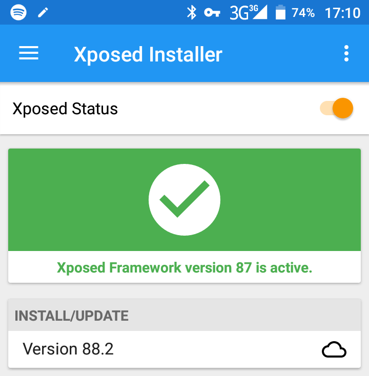
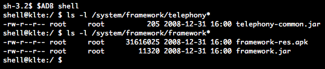
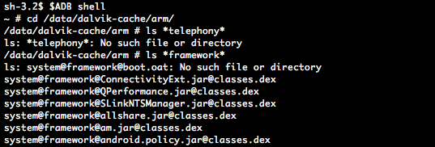
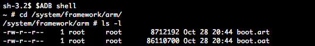
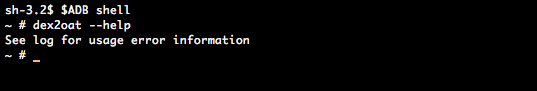
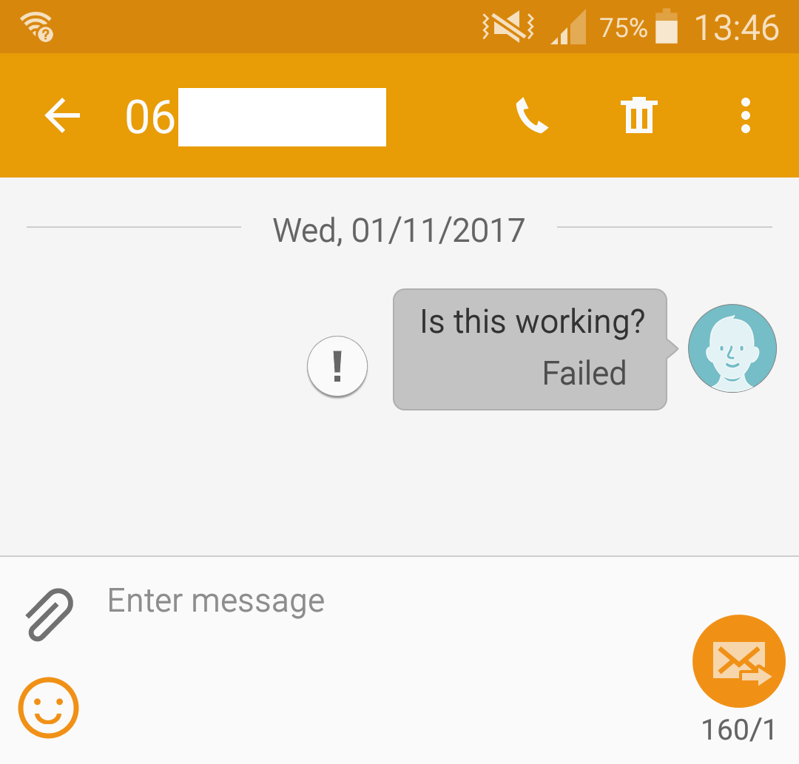

# Injecting rogue code into stock Android ROMs

_2017/11/01 Cecill Etheredge // ijsf_

---

As part of a recent mobile security project, I have been looking at ways to add or change core functionality within Android phones given two strict requirements: first of all, any changes have to be traceless or otherwise minimally invasive, and secondly, the changes should be compatible with as many devices and vendors as possible.

Writing this up now, it sounds awfully similar to the requirements of an Android based backdoor of some kind, but rest assured that this project is quite different. Instead, it is concerned with keeping phones as "vanilla" as possible while explicitly disabling core functionality such as being able to dial or SMS. Yet, to able to do this, we do need to insert a bit of "rogue" code.

Now, the catch of this project is that each phone is under physical control and we can do whatever we like with it, as long as the modifications are traceless. This means that we are able to modify the phone ROMs any way we like. For this reason, we assume that each phone contains a custom recovery tool (e.g. [TWRP](https://twrp.me)) as an entry point for further system ROM modifications.

Remember that we aim to use as few tools as possible to ensure maximum compatibility across different devices and vendors, and avoiding non-standard custom tools is preferable. The whole process must be simple and clean, and should preferably use any available tools on the phone itself instead of on a host system.

## Core frameworks

If you are a little bit familiar with modifying Android ROMs or rooting Android, you may have heard of the [Xposed Framework](http://repo.xposed.info). The idea behind Xposed is to allow modification of core Android functionality without having to go through the process of disassembling and reassembling any files. Instead, it works by installing itself into [Zygote](https://developer.android.com/topic/performance/memory-overview.html), Android's lowest process manager from which every conventional process on Android is spawned. By becoming part of every process, it can hook specific functions and redirect them to a custom implementation.



Although the Xposed framework would very likely allow the modification we are looking for, I concluded it would be unsatisfactory due to the fact that it is not traceless: it requires a permanent in-memory presence of the Xposed framework itself, as well as an installer app. Furthermore, "vanilla" security is no longer guaranteed because Xposed may open up new security vulnerabilities and potential backdoors. It is therefore much too invasive, and another alternative had to be found.

The most basic approach would be simply to replace the core framework with a patched version.

## Replacing the core framework

Let us start off with the fact that our modifications aim to completely disable any outgoing call and SMS messages. A suitable choice to perform these modifications is the `telephony-common.jar` file as built through the AOSP (Android Open Source Project) [telephony](https://android.googlesource.com/platform/frameworks/opt/telephony/+/master) codebase. Specifically, the following files are of interest:

*   [GsmCdmaPhone.java](https://android.googlesource.com/platform/frameworks/opt/telephony/+/master/src/java/com/android/internal/telephony/GsmCdmaPhone.java) - contains the function `GsmCdmaPhone.dial` that we should patch.
*   [GsmSMSDispatcher.java](https://android.googlesource.com/platform/frameworks/opt/telephony/+/master/src/java/com/android/internal/telephony/gsm/GsmSMSDispatcher.java) - contains the function `GsmSMSDispatcher.sendSms` that we should patch.

Patching the above functions in the original **_Jar_** files on the stock ROM should allow us to disable outgoing calls and messages. So how does one patch these Jar files?

First of all, patching conventional Jar files is as easy as unzipping, disassembling the .class files, reassembling and rezipping. It is something that has been done for a long time due to Java and Jar being around for a quite a while. As a matter of fact, system Jar files are typically contained in `/system/frameworks`.

As it appears, the framework Jar files on our target test device (Samsung S5) are either empty or only contain resources, but no code whatsoever. Hold that thought.



An extensive search on the net, Android newsgroups and XDA developers then yielded a handful of results, all dead ends because of the following reasons:

*   Modern Android retail devices no longer ship with usable Jar files of core frameworks. Instead, frameworks are compiled or "dexed" into [.dex files](https://source.android.com/devices/tech/dalvik/). These **_Dex_** files contain compiled Dalvik Executable bytecode meant for Just-In-Time (JIT) runtime usage and are much more optimized than previous executable formats, and are then run by either the Android Runtime (ART) or the Dalvik runtime depending on Android version.
*   Although .dex files can be disassembled and reassembled using tools [smali/baksmali](https://github.com/JesusFreke/smali), nearly all information on the net is concerned with repacking or retooling APKs (Android apps) using this approach. There is hardly any info out there on how to do this with core frameworks such as telephony-common. The few leads I did find were single posts of people being stuck after having done their modifications with an Android OS that no longer booted or crashed indefinitely.

Android in fact keeps all Dex files for all frameworks and apps in its Dalvik Cache, a special partition purely meant for the purpose of keeping Dex files for further optimization passes. However, although our Dalvik Cache is filled with many Dex files from non-core frameworks and apps, it turns out that our core framework Dex files aren't present at their expected location.



First of all, the core frameworks are built and packaged quite differently from normal applications. This should come as no surprise though, as they are fundamental to all other apps and services on the system. The major difference is that the Dex files are indeed not at all present in `/system/frameworks`, at least, not as normal files.

Instead, they have been compiled into obscure **OAT** (Of Ahead Time) and **ART** files which are scarcely documented though some research exists on their structure,  specifically the talks [Hiding Behind ART](http://www.blackhat.com/docs/asia-15/materials/asia-15-Sabanal-Hiding-Behind-ART-wp.pdf) and [State of the ART](https://conference.hitb.org/hitbsecconf2014ams/materials/D1T2-State-of-the-Art-Exploring-the-New-Android-KitKat-Runtime.pdf). This has to do with the fact that this ROM uses the even newer Android Runtime (ART) and utilizes its ahead-of-time compilation.

The "boot image" files in question (e.g. `boot.art` and `boot.oat`) typically exist in an architecture-dependent directory such as `/system/framework/arm`. They contain a very optimized ahead-of-time natively compiled version of all core frameworks and any necessary preinitialization of classes and objects.

What is interesting but even more confusing about this approach is a number of things:

*   All **._dex_** files in `/data/dalvik-cache` are in fact Android Runtime _**.oat**_ files.
*   These _**.oat**_ files are compiled by **dex2oat** on the phone itself, e.g. during first bootup or after app installation, taking the original _**.dex**_ or _**.odex**_ (Optimized Dex) files from the app as a source.

Confusing isn't it? This was probably done for backwards compatibility reasons.



Considering that **dex2oat** is the first choice OAT compiler for Android, we deduce that the boot image file `boot.oat`, in which the to-be-patched `telephony-common` framework can be found, is very likely to also have been compiled by **dex2oat**. However, since the original Dex files are nowhere else to be found on the ROM, it follows that it cannot be compiled on the phone itself and must have been compiled by the vendor's build system at the time of generating the ROM itself. A quick look in the [AOSP code base](https://android.googlesource.com/platform/build/+/master/core/dex_preopt_libart_boot.mk) shows this to be true.

The advantage of **dex2oat** is that it should be available on the phone itself. Since it is capable of generating the boot images as well, it would mean that the phone itself should be capable of recompiling new boot images if the appropriate input files were somehow made available on the device.

This is a huge win, since it won't require the use of any architecture dependent AOSP build system tools on our end. By uploading the necessary patched core framework input files to the phone, and by leveraging **dex2oat**, a phone should be able to provision itself with a new boot image... at least in theory.

## Let's get patching

As mentioned before, our target framework has been compiled into the `boot.oat` file, so the first course of action is to make sure we can even extract this framework in useable form. It turns out that we do require a custom tool for this purpose, namely [oat2dex](https://github.com/testwhat/SmaliEx). Running **oat2dex** should then extract a valid `telephony-common.dex` file, that can be disassembled using **smali**, from which it should then be possible to patch and reverse the entire process. This sort of looks something like this:

1.  `adb pull /system/framework/arm/boot.oat` (pull)
2.  `oat2dex boot.oat` (unpack)
3.  `smali telephony-common.dex` (decompile)
4.  Patch.
5.  `baksmali telephony-common.dex` (compile)
6.  `dex2oat boot.oat` (pack)
7.  ???
8.  Profit.

Note that we despite the effort of using at little tools as possible, we do require the **oat2dex** and **smali/baksmali** tools for this purpose, but that's okay for now. Skipping ahead with the first 3 uneventful pull, unpack and decompile steps, we eventually arrive at the relevant target code files:

##### GSMPhone.smali

```
.class public Lcom/android/internal/telephony/gsm/GSMPhone;
.super Lcom/android/internal/telephony/PhoneBase;
.source "GSMPhone.java"

…

.method public dial(Ljava/lang/String;Lcom/android/internal/telephony/UUSInfo;ILandroid/os/Bundle;II[Ljava/lang/String;)Lcom/android/internal/telephony/Connection;
    .registers 25
    .param p1, "dialString"    # Ljava/lang/String;
    .param p2, "uusInfo"    # Lcom/android/internal/telephony/UUSInfo;
    .param p3, "videoState"    # I
    .param p4, "intentExtras"    # Landroid/os/Bundle;
    .param p5, "callType"    # I
    .param p6, "callDomain"    # I
    .param p7, "extras"    # [Ljava/lang/String;
    .annotation system Ldalvik/annotation/Throws;
        value = {
            Lcom/android/internal/telephony/CallStateException;
        }
    .end annotation

    .prologue

…

.end method
```

##### GSMSMSDispatcher.smali

```
.class public final Lcom/android/internal/telephony/gsm/GsmSMSDispatcher;
.super Lcom/android/internal/telephony/SMSDispatcher;
.source "GsmSMSDispatcher.java"

…

.method protected sendSms(Lcom/android/internal/telephony/SMSDispatcher$SmsTracker;)V
    .registers 12
    .param p1, "tracker"    # Lcom/android/internal/telephony/SMSDispatcher$SmsTracker;

    .prologue

…

.end method
```

Without diving too much into the characteristics of the smali assembly format and correlating the above assembly to the original Java code, our patches to disable outgoing calls and messages using these functions is an old trick from the book. Just NOP the two functions by replacing their functionality with a return:

##### Patched GSMPhone.smali

```
.method public dial(Ljava/lang/String;Lcom/android/internal/telephony/UUSInfo;ILandroid/os/Bundle;II[Ljava/lang/String;)Lcom/android/internal/telephony/Connection;
    .prologue
    new-instance v2, Lcom/android/internal/telephony/CallStateException;
    const-string v3, "blocked"
    invoke-direct {v2, v3}, Lcom/android/internal/telephony/CallStateException;-><init>(Ljava/lang/String;)V
    throw v2
    return-void
.end method
```

##### Patched GSMSMSDispatcher.smali

```
.method protected sendSms(Lcom/android/internal/telephony/SMSDispatcher$SmsTracker;)V
    .prologue
    return-void
.end method
```

Here we go, outgoing calls and messages disabled! In theory at least.

## Generating new boot images

Now, having patched the smali files, the next logical step would be to compile and pack back into the `boot.oat` and `boot.art` image files. It turns out that these steps are far more trickier than I expected, as witnessed by several messages floating around on the net of others having tried the same but failing due to very obscure reasons.

The **baksmali** step is quite straightforward. It will produce a valid `telephony-common.dex` file that, along with all the original files extracted from the boot images, should be packed into a new set of boot images through **dex2oat**.

First hurdle here is that the **dex2oat** tool is very obscure: it is an internal AOSP tool and hardly any documentation can be found on how to use it. It does turn out to have a usage help though if you attempt to run it through adb:



By combining the quite extensive (though incomplete) usage information with a peek in its [source code](https://android.googlesource.com/platform/art/+/master/dex2oat/dex2oat.cc) as well as a few [build Makefiles](https://android.googlesource.com/platform/build/+/master/core/dex_preopt_libart_boot.mk), a functioning set of command-line arguments could be deduced:

```
/system/bin/dex2oat \
    --image=/data/local/tmp/boot.art.new \
    --oat-file=/data/local/tmp/boot.oat.new --oat-location=/system/framework/arm/boot.oat \
    --include-patch-information \
    --no-generate-debug-info \
    --compile-pic \
    --instruction-set=arm \
    --base=0x70000000 \
    --image-classes=/data/local/tmp/preloaded-classes \
    --dex-file=/path/to/first.dex --dex-location=/system/framework/first.dex \
    --dex-file=/path/to/second.dex --dex-location=/system/framework/second.dex \
    …
```

Let's begin with a breakdown of what the above command does:

*   `--image` produces a new ART file at `/data/local/tmp/boot.art.new`. This location is important since it must be executable, and therefore the regular SD card cannot be used.
*   `--oat-file` produces a new OAT file at `/data/local/tmp/boot.oat.new`. Must also be executable.
*   `--oat-location` produces the appropriate symbol name in the boot image.
*   `--include-patch-information` and `--no-generate-debug-info` seem to be the default for production ROMs.
*   `--compile-pic` produces platform independent code and seems to be a requirement for compilation to work, since many native C/C++ libraries are also linked in during compilation.
*   `--instruction-set=arm` specifies the architecture to use.
*   `--base=0x70000000` specifies the default ART base address, which seems to be `0x70000000` as default. Note that this does not have to equal to the original boot image base address.
*   `--image-classes` specifies the classes to preload and initialize in order, which seems to effectively specify the contents of the `boot.art` file. A list of these preloaded classes happens to be available at `/system/etc/preloaded-classes`. It was copied to `/data/local/tmp` because it could not be read from its original location due to an obscure reason.
*   The command line then proceeds with an enumeration of all Jar files, using `--dex-file` to specify the actual filesystem path and `--dex-location` to specify the virtual path or location after being packed into the OAT file.

Note that the **dex2oat** tool is quite picky. It may crash or throw strange exceptions if any of its input files contain errors that were not caught earlier by **baksmali**.

The above command has to be executed on the phone itself while it is running the stock ROM. It produces a set of boot images at`/data/local/tmp` that then have to copied to their appropriate paths at `/system/framework/arm`. Needless to say, this is not possible without any form of root access, so we turn to our custom recovery (e.g. TWRP) to swap out the actual files. The process more or less looks like this:

1.  Generate new boot images at `/data/local/tmp` from stock.
2.  Reboot into custom recovery.
3.  Wipe Dalvik cache.
4.  Mount system as read-write.
5.  Swap out boot images into `/system/framework/arm`.
6.  Reboot into stock.

It obviously helps to keep any backups in case of problems. Careful consideration must be given to the bootup logs after rebooting back into stock. The phone should go into a minute long process of recompiling its services and apps (using **dex2oat**). If the boot images turn out to be faulty in any way, your phone will throw a lot of errors in the adb logs, apps and services will crash, boot loops may occur or it may not boot at all.

There's one catch.

Apparently we **can not** use Dex files as input to generate boot images ...

## Not every Dex is what it seems

What you will see (as have a few others on the net) if you attempt to use boot images that have been generated with Dex input files, is a large number of errors such as:

```
W art     : Failed to open zip archive '/system/framework/telephony-common.dex'
```

As the phone boots up after replacing the boot images, the Android Runtime (ART) will detect and process the new boot images into the Dalvik cache for further use. It will attempt to find the original Dex files that have been compiled into `boot.oat` by resolving the paths specified with the `--dex-location` parameters.

This poses a problem, because first of all, the Dex files were never present at `/system/framework` in the stock ROM. But recall from before that the stock ROM does have its framework Jar files at this location, some of which are empty but some of which contain resources such as images or XML files.

I only realized this after a few hours of analyzing logs, but when the device vendor was building the original stock ROM and the boot OAT, it wasn't using Dex files, and it wasn't using the Jar files present on the stock ROM. It was using a different set of Jar files altogether!

## Reconstructing source Jar files

The original Jar files that AOSP uses to build the boot images contain both resources and compiled Dex code (a.k.a. completely typical Jar files). In the process of generating the stock ROM however, the Jar file is effectively split: its Dex code ends up in the OAT boot image, and its resources end up in a new resource-only Jar file located at `/system/framework`. ART then reassembles these when booting up.

By reconstructing a set of Jar files with the same contents as the originals, we should be able to generate fully functioning boot images. This turns out to be quite easy:

1.  For each Dex file extracted from the OAT image, pull the Jar file with the same filename from `/system/framework`. This file will either be very small or may otherwise contain essential resources.
2.  For each Jar file, add the Dex file into the Jar, renaming it `classes.dex`. This is how ART will resolve Dex code inside Jar files. Pay attention that some Dex files may be so called "Multi Dex" files and should be added accordingly (e.g. `framework.dex -> classes.dex`, `framework-classes2.dex -> classes2.dex`, etc).

You will then end up with a set of Jar files that contain both the Dex code and essential resources. Perhaps confusing, these Jar files will have to be passed into **dex2oat** by using the `--dex-file` and `--dex-location` arguments despite them not being Dex files strictly. Make sure both arguments use the `.jar` extension such that ART can properly find them where they are located.

It is important to know that the Jar files you will use to generate the boot images do NOT have to uploaded into `/system/framework`. You can safely delete them after you have generated your `boot.oat` and `boot.art` files.

## Putting things together

Having generated your `boot.oat` and `boot.art` boot image files, it makes sense to replace your originals with these patched versions as outlined above. If all goes well, your phone will boot up, perform its usual recompile or "optimization" passes and should function without any problems.



To make sure there are no lingering issues, it is probably smart to check the following:

*   The "optimizing apps" startup sequence should take a long time. If it is much quicker than normal, it probably means that the optimization process is aborting prematurely for each app. The screen will not show this, but the logs will.
*   Scan the **adb** logs for any **dex2oat** process errors (which will process all apps), e.g. by using `adb logcat | grep -i 'dex2oat'`.
*   Scan the **adb** logs for any **art** process errors (which will process the boot images), e.g. by using `adb logcat | grep -i ' art'`.

Then, if all goes well, your phone should be functioning, though with your patches in place. In our case, our outgoing calls and SMS messages are now disabled 👍
