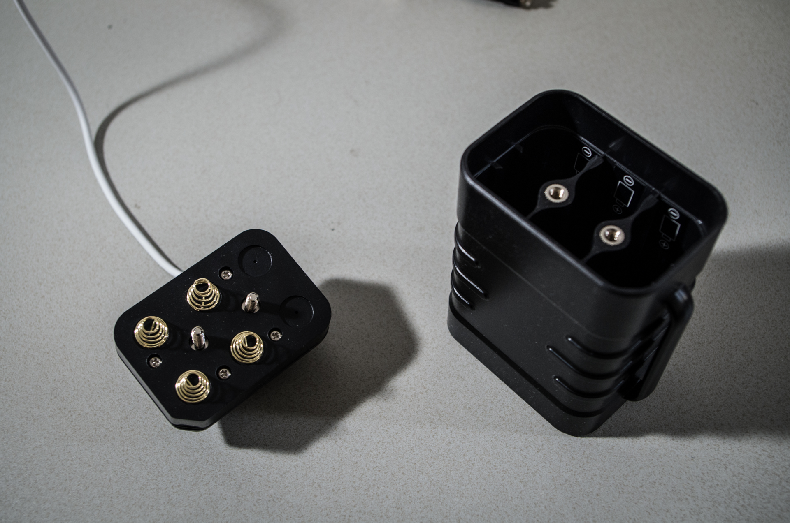
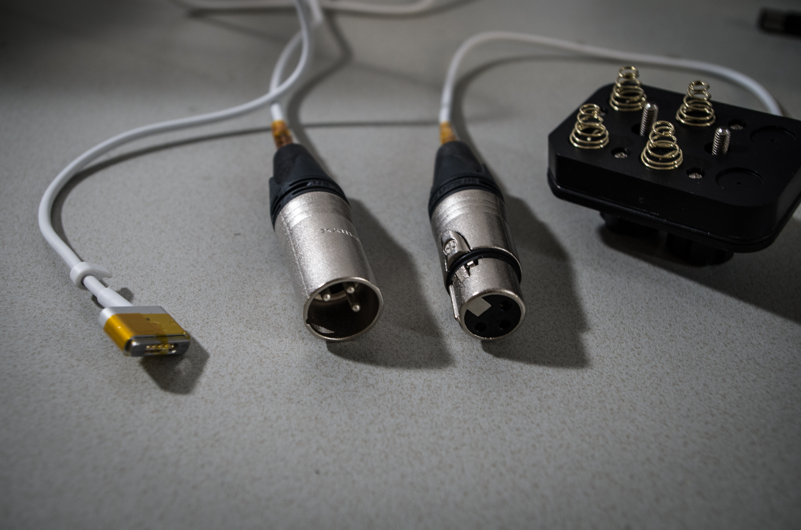
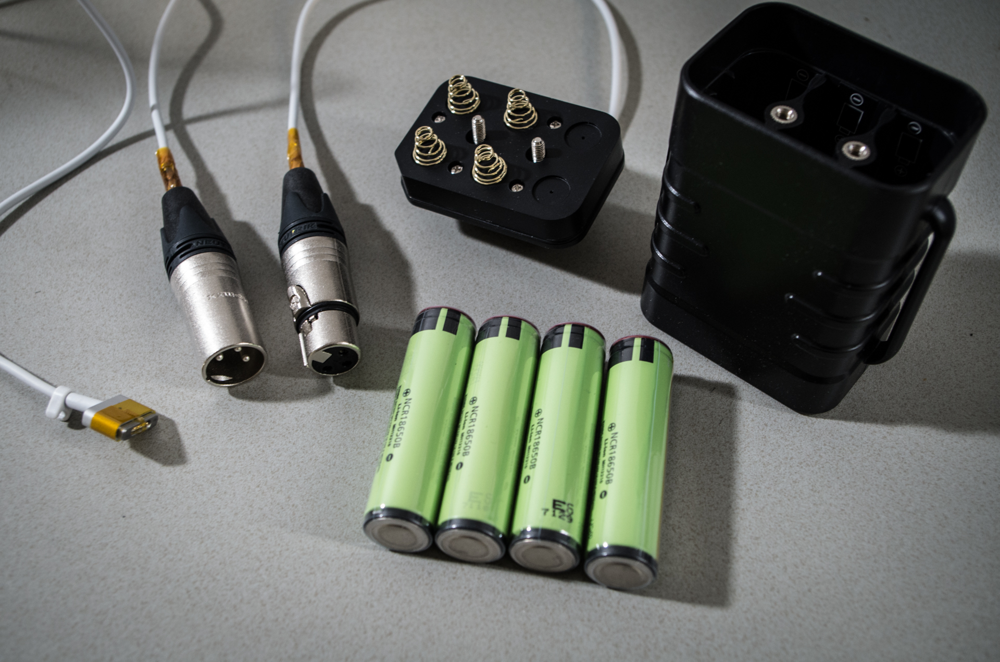

# From batteries to MagSafe power bank 2.0

_2018/04/27 Cecill Etheredge // ijsf_

---

In my [previous article](20170802_from_scrap_batteries_to_magsafe_power_bank.html), I did an attempt at creating a MagSafe power bank out of scrap batteries that could be hooked up to various Macbook devices.

Using a few hardware schematics, it was possible to more or less figure out the minimum and maximum ballpark voltages that the receiving end of the MagSafe connector could handle. Using a set of 5 batteries hooked up in series, a power bank could be created that would provide a few extra hours of playtime out in the open.

The real world often works a little bit different though. Shortly after I did the write up, I ended up taking the bank apart as it was deemed pretty unsafe for daily use. Remember, when you're working with batteries, you're working with potentially explosive devices!

Some dangerous oversights, also pointed out by some careful readers:

-   **Don't use scrapped batteries!**

    The 18650 cells were apparently never used, but some were at dangerously low voltages, indicating internal chemical failure or expiration. Charging these could have been disastrous.

-   **Don't use unprotected batteries!**

    The 18650 cells were part of a specialized pack manufactured and sealed by Panasonic. The cells themselves did not contain any protection mechanisms, as they were included on the charger PCB (which was promptly discarded). Overcharging or shorting could have been disastrous.

-   **Don't use connectors unsuited for batteries!**

    The DIY pack contained a simple female DC barrel jack that could be used for both charging and discharging. When the cells were charged, plugging in the jack would cause sparks. It would've been difficult but possible for the positive and negative leads (and thus the cells) to shorten out if mishandled.

-   **Keep it stupid simple!**

    The DIY pack was meant for both charging and discharging, relied on a cheap battery management PCB to do the job and provide protection, and was then sealed. It tried to do too much and thus became unsafe as there were too many weak links to fail.

Anyway, enough lessons to be learned. Let's jump to 2018 and as you will see, our DIY pack 2.0 is indeed much more Stupid Simple!

Let's start off with a somewhat proper (though cheap) ruggedized container, which can be found on most Chinese outlets.

This time around, there will be no charging circuit. This container will simply be a container for charged 18650 cells, and the charging itself will be done by a proper charger device in the safety of my own home, much easier!

Again, the MagSafe connector takes a wide range of voltages typically between 12 and 20 V. Assuming standard 18650 Lion cells with a voltage of 4.2 V each, either 4 or 5 cells in series will provide a maximum voltage of either 16.8 V or 21 V. Given how the container is shaped, it makes a lot more sense to use 4 cells this time, as we can simply swap around some wiring in the top part of the container.

Originally, this particular container was designed for 5 V USB output and had a complete discharging circuit with some kind of buck/boost conversion with a specific battery configuration (probably 2S3P or similar). Needless to say, all that circuitry was desoldered and discarded. Copper traces were removed where due and wiring was refitted to accommodate any changes.

As you can see, the top part is actually screwed into place securely (takes a while), and as such there is simply no other way to mechanically disconnect the batteries. I didn't like the idea of having fully charged 18650 cells with a MagSafe just flapping in the breeze moving around in my bag all the time. The pogo pins on the MagSafe connector don't have a lot of clearance, so there's a potential for shorting out.

As an easy but ruggedized solution, I ordered up a pair of ruggedized Neutrik XLR connectors with a quicklock mechanism. These connectors are well known in the audio industry and are used for high output audio gear in the relatively harsh environment of stages, studios and such. Using plenty of good old Kapton tape and heatshrink, the leads were isolated from each other, and the female connector was used for the battery side of things.

In the end, everything came together nice and quite easily. I had already ordered some (new!) Panasonic 18650 cells before with protection circuits, and had tested them on a proper Lion charger/tester to find out they were indeed providing 3500 mAh at a healthy voltage.

As in DIY pack 1.0, the middle pin of the MagSafe connector was taped off to prevent the Macbook from charging the internal battery.. using the external battery, which really doesn't make sense for efficiency. Macbooks are designed in such a way that they will actually bypass the internal battery and use the AC input whenever the middle pin is masked off, which is a feat we can use here.

All in all, this power bank should provide a few extra hours of outdoor usage, this time in a relatively safe way.. hopefully!
