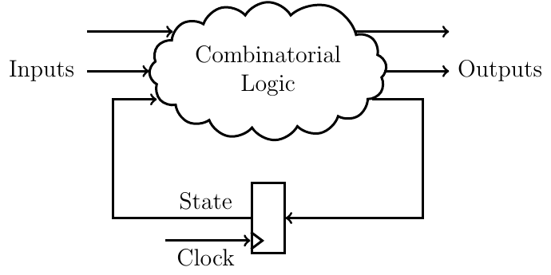

# A Basic Introduction to Clash for FPGA Development - Part 2

_2018/05/14 Oguz Meteer // guztech_

---

***This post is part of a series:***

* [Part 1 - Basic introduction to combinatorial logic](20180320_a_basic_introduction_to_clash_for_fpga_development_part_1.md)
* [Part 2 - Bug fixes, much cleaner code, simulation, synchronous logic, and test benches](20180514_a_basic_introduction_to_clash_for_fpga_development_part_2.md)

---

In our previous post, I gave a brief introduction on how to create simple combinatorial hardware in Clash and we ended up with a partly working, ugly circular stack implementation. In this post we will fix the bug, tidy up the code to make it much nicer to read, and simulate our design.

***Reminder:*** All the code for this post and future posts can be found on [GitLab](https://gitlab.com/GuzTech/bitlog_clash_tutorial) and [Github](https://github.com/GuzTech/bitlog_clash_tutorial/tree/master/). The code for this part is in the [part\_2](https://github.com/GuzTech/bitlog_clash_tutorial/tree/master/part_2) folder.

Fixing the bug
==============

Continuing from where we [left off last time](20180320_a_basic_introduction_to_clash_for_fpga_development_part_1.md), let's fix the bug in our previous circular stack implementation. Open up [Example1.hs](https://github.com/GuzTech/bitlog_clash_tutorial/tree/master/part_2/Example1.hs) where I have the same implementation we ended up with previously called ***stack2***. For viewing convenience, I'll post it here as well:

```
module Example1 where
import CLaSH.Prelude

stack2 (mem, sp) push pop value = ((mem', sp'), o)
  where
    (mem', sp') = case push of
      True  -> case pop of
        True  -> (replace sp value mem, sp)
        False -> (replace sp value mem, sp + 1)
      False -> case pop of
        True  -> (mem, sp - 1)
        False -> (mem, sp)
    o = case pop of
      True -> mem !! sp'
      _    -> 0

topEntity
  :: (Vec 8 (Signed 16), Unsigned 3)
  -> Bool 
  -> Bool
  -> Signed 16
  -> ((Vec 8 (Signed 16), Unsigned 3), Signed 16)
topEntity = stack2

-- Push 3 on the stack
x = topEntity (repeat 0, 0) True False 3

-- Push 5 on the stack
y = topEntity (fst x) True False 5

-- Pop the last value off of the stack
z = topEntity (fst y) False True 0

-- Pop the last value off of the stack and replace it with 42
w = topEntity (fst z) True True 42
```

I have also added four evaluations of our stack function named ***x***, ***y***, ***z***, and ***w***. Let's check the type of ***x*** (and ***y***, ***z***, and ***w*** as well since they are the same):

```
*Example1> :t x
x :: ((Vec 8 (Signed 16), Unsigned 3), Signed 16)
     \\                /            /           /
      \-------1--------            /           /
       \\                         /           /
        \------------2------------           /
         \                                  /
          -----------------3----------------
```

So ***x*** is a tuple (**3**), where the first element (**2**) is also a tuple. The first element of (**2**) is a vector of size 8 that holds 16-bit signed integers (**1**), and the second element is a 3-bit unsigned integer. The second element of (**3**) is a 16-bit signed integer.

Looking at what the ***stack2*** function returns `((mem', sp'), o)`, we know that `mem'` is a vector of size 8 that holds 16-bit signed integers (our memory), `sp'` is a 3-bit unsigned integer (our stack pointer), and `o` is a 16-bit signed integer (the value that we conditionally pop off of the stack).

If we evaluate them, we get the following results:

```
*Example1> x
((<3,0,0,0,0,0,0,0>,1),0)

*Example1> y
((<3,5,0,0,0,0,0,0>,2),0)

*Example1> z
((<3,5,0,0,0,0,0,0>,1),5)

*Example1> w
((<3,42,0,0,0,0,0,0>,1),5)
```

First we push the value 3 on the stack (***x***), where the memory at index 0 gets replaced with the value 3, the new stack pointer becomes 1, and the output of the stack is 0 since we didn't pop anything off of it. Similarly, when we then push the value 5 on the stack (***y***), the value at memory index 1 becomes 5, the new stack pointer becomes 2, and the output is still 0.

We then pop the latest value off of the stack (***z***), so the stack pointer is decreased to 1, and the output is 5. Note that the contents of the memory doesn't change because we do not replace anything in our implementation when we pop something off of the stack.

Finally, we push the value 42 and pop at the same time (***w***). The correct behavior should be that the value 3 at index 0 should be popped off of the stack and be replaced by 42. Instead, the value at index 1 gets popped off again and replaced. The bug here is that the evaluation of `o` does not take into account that we could also simultaneously push onto the stack as well.

As mentioned in [the previous post](https://bitlog.it/hardware/a-basic-introduction-to-clash-for-fpga-development/), the current stack pointer always points to the memory location where the next value would be pushed onto. That means that `sp - 1` points to where we last pushed a value. Since we want to pop that value, and replace it with the new value, `sp - 1` should be used when we both push and pop at the same time. Our current implementation however, always uses `sp'` which can evaluate to either `sp` or `sp + 1`, but never `sp - 1`. Let's fix our implementation which can be found in [Example2.hs](https://github.com/GuzTech/bitlog_clash_tutorial/blob/master/part_2/Example2.hs):

```
stack2 (mem, sp) push pop value = ((mem', sp'), o)
  where
    (mem', sp') = case push of
      True  -> case pop of
        True  -> (replace (sp - 1) value mem, sp)
        False -> (replace sp value mem, sp + 1)
      False -> case pop of
        True  -> (mem, sp - 1)
        False -> (mem, sp)
    o = case pop of
      True -> case push of
        True  -> mem !! (sp - 1)
        False -> mem !! sp'
      _    -> 0
```

We have adjusted the index of memory that gets replaced (line 5), and which value to place on the output (line 12). When we evaluate ***x***, ***y***, ***z***, and ***w***, we now get the correct results:

```
*Example2> x
((<3,0,0,0,0,0,0,0>,1),0)

*Example2> y
((<3,5,0,0,0,0,0,0>,2),0)

*Example2> z
((<3,5,0,0,0,0,0,0>,1),5)

*Example2> w
((<42,5,0,0,0,0,0,0>,1),3)
```

Making The Code Nicer
=====================

***Recommended reading material: [Making Our Own Types and Typeclasses](http://learnyouahaskell.com/making-our-own-types-and-typeclasses)***

While we have fixed our stack implementation, it still looks ugly and convoluted. All those `True`s and `False`s make it confusing to understand what's going on, so let's define our own data types to make life easier. You can think of data types as enumerations in other languages. There are a couple of ways to do this, and I will present one (and a half) way. Here is [Example3.hs](https://github.com/GuzTech/bitlog_clash_tutorial/blob/master/part_2/Example3.hs):

```
module Example3 where
import CLaSH.Prelude

data SInstr = Push
            | Pop
            | PopPush
            deriving (Show)

stack3 (mem, sp) instr value = ((mem', sp'), o)
  where
    (mem', sp') = case instr of
      Push    -> (replace sp value mem, sp + 1)
      Pop     -> (mem, sp - 1)
      PopPush -> (replace (sp - 1) value mem, sp)
    o = case instr of
      Pop     -> mem !! sp'
      PopPush -> mem !! (sp - 1)
      _       -> 0

topEntity
  :: (Vec 8 (Signed 16), Unsigned 3)
  -> SInstr
  -> Signed 16
  -> ((Vec 8 (Signed 16), Unsigned 3), Signed 16)
topEntity = stack3

-- Push 3 on the stack
x = topEntity (repeat 0, 0) Push 3

-- Push 5 on the stack
y = topEntity (fst x) Push 5

-- Pop the last value off of the stack
z = topEntity (fst y) Pop 0

-- Pop the last value off of the stack and replace it with 42
w = topEntity (fst z) PopPush 42
```

Here we created a data type `SInstr` that has three distinct values (or *nullary constructors*): `Push`, `Pop`, and `PopPush`. Furthermore we are using this data type to pattern match in our ***stack3*** function, and we have replaced the two `Bool` types in ***topEntity*** with `SInstr`. It is functionally equivalent to ***stack2***, but I think it is safe to say that this version is much easier to read and understand.

Now I said that you can think of data types as enumerations in other languages. However, what we can do in Haskell (and therefore in Clash) is have zero or more values associated with each constructor. Here is another method of implementing the stack using a data type with values ([Example4.hs](https://github.com/GuzTech/bitlog_clash_tutorial/blob/master/part_2/Example4.hs)):

```
module Example4 where
import CLaSH.Prelude

data SInstr = Push (Signed 16)
            | Pop
            | PopPush (Signed 16)
            deriving (Show)

stack4 (mem, sp) instr = ((mem', sp'), o)
  where
    (mem', sp') = case instr of
      Push val    -> (replace sp val mem, sp + 1)
      Pop         -> (mem, sp - 1)
      PopPush val -> (replace (sp - 1) val mem, sp)
    o = case instr of
      Pop       -> mem !! sp'
      PopPush _ -> mem !! (sp - 1)
      _         -> 0

topEntity
  :: (Vec 8 (Signed 16), Unsigned 3)
  -> SInstr
  -> ((Vec 8 (Signed 16), Unsigned 3), Signed 16)
topEntity = stack4

-- Push 3 on the stack
x = topEntity (repeat 0, 0) (Push 3)

-- Push 5 on the stack
y = topEntity (fst x) (Push 5)

-- Pop the last value off of the stack
z = topEntity (fst y) Pop

-- Pop the last value off of the stack and replace it with 42
w = topEntity (fst z) (PopPush 42)
```

In this version, the `SInstr` data type has again the three constructors we had before, but now `Push` and `PopPush` also have one value of type `Signed 16` associated with them. The ***stack4*** function now does not have the ***value*** input argument anymore since it is now integrated into ***instr***, if it is either `Push` or `PopPush`. When we pattern match on ***instr***, and it matches `Push` or `PopPush`, then we know that there is a value associated with it, which we give the name ***val*** in lines 12 and 14, and we ignore it in line 17 (indicated by the "\_"). The type of ***topEntity*** also becomes a bit simpler since we do not have to specify the value that we conditionally want to push on the stack anymore.

When we evaluate our topEntity, you can see that we put parentheses around the `Push` and `PopPush` arguments since they are now one thing compared to the previous version where `Push`/`PopPush` and the value were two separate inputs to ***topEntity***. Depending on your preferences and application, you might want to use either version.

Making It Even Nicer
====================

While the code is looking much better compared to previous versions, we can still make it a bit nicer. What if we want our stack to store 23-bit unsigned integers? What if we want to change the size of the stack? We would have to change quite a bit of code, which is not only more work, but also more error prone. We are going to define our own types to make our implementation easier to read and change. Here is [Example5.hs](https://github.com/GuzTech/bitlog_clash_tutorial/blob/master/part_2/Example5.hs):

```
module Example5 where
import CLaSH.Prelude

type Value      = Signed 16
type SizeInBits = 3
type StackDepth = 2^SizeInBits
type SP         = Unsigned SizeInBits
type SMem       = Vec StackDepth Value

data SInstr = Push Value
            | Pop
            | PopPush Value
            deriving (Show)

stack4 (mem, sp) instr = ((mem', sp'), o)
  where
    (mem', sp') = case instr of
      Push val    -> (replace sp val mem, sp + 1)
      Pop         -> (mem, sp - 1)
      PopPush val -> (replace (sp - 1) val mem, sp)
    o = case instr of
      Pop       -> mem !! sp'
      PopPush _ -> mem !! (sp - 1)
      _         -> 0

topEntity
  :: (SMem, SP)
  -> SInstr
  -> ((SMem, SP), Value)
topEntity = stack4

-- Push 3 on the stack
x = topEntity (repeat 0, 0) (Push 3)

-- Push 5 on the stack
y = topEntity (fst x) (Push 5)

-- Pop the last value off of the stack
z = topEntity (fst y) Pop

-- Pop the last value off of the stack and replace it with 42
w = topEntity (fst z) (PopPush 42)
```

Here we have defines five types:`Value`, `SizeInBits`, `StackDepth`, `SP`, and `SMem`, where some types depend on others. If we want to change the size of the stack, just adjust`SizeInBits`, and if we want to store a different type of values, simply change`Value`. The type of ***topEntity*** also becomes much less convoluted and easier to understand: it takes a tuple of a memory and a stack pointer, and an instruction, and outputs a value.

Easier Simulation
=================

***Recommended reading material: [Starting Out](http://learnyouahaskell.com/starting-out), [Recursion](http://learnyouahaskell.com/recursion)***

Writing logic is fun and all, but we need to be able to test it. I've written four expressions ***x***, ***y***, ***z***, and ***w***, but this is not very scalable so we need a better way. While there are simulation functions in Clash, I'm not going to use them here now and show you how you can easily create your own custom simulation functions. Open up [Example5\_sim.hs](https://github.com/GuzTech/bitlog_clash_tutorial/blob/master/part_2/Example5_sim.hs) to follow along:

```
--
-- Simulation
--
instrs = [Push 3, Push 5, PopPush 6, Pop, Pop]

-- Simulation function that just stores the output
sim_o f s [] = []
sim_o f s (x:xs) = o:sim_o f s' xs
  where
    (s', o) = f s x
```

First we define a list of `SInstr` that we want to use as input stimuli. We then create a function ***sim\_o*** that accepts three inputs. Let's first look at its type and divide it into smaller parts:

```
*Example5_sim> :t sim_o
sim_o :: (t2 -> t1 -> (t2, t)) -> t2 -> [t1] -> [t]
```

1.  The first input has the type `(t2 -> t1 -> (t2, t))` which in this case is not a tuple (there is no comma in there), but a function. How do we know this? Well, if you look at the type of ***topEntity***, you also see arrows which separate the inputs and output. If you're curious about why arrows are used, look up [*Currying*](http://learnyouahaskell.com/higher-order-functions). What you need to know however is that when you see arrows, you know it's a function. In our case, the first argument is a function that takes two inputs of type `t2` and `t1`, and one output that is a tuple of something with types `t2` and `t`.
2.  The second input has type `t2`.
3.  The third input is a list (indicated by brackets) of things with type `t1`.
4.  Finally, the output is a list of things with type `t`.

These abstract looking types may seem confusing, but what if we replace them with the types of our ***topEntity*** (or ***stack5***) function?

1.  `t2` = `(SMem, SP)`
2.  `t1` = `SInstr`
3.  `t` = `Value`

What we then get is the following:

```
sim_o :: ((SMem, SP) -> SInstr -> ((SMem, SP), Value)) -> (SMem, SP) -> [SInstr] -> [Value]
```

Does the first input look familiar? What first looked very abstract, now perfectly matches our ***stack5*** and ***topEntity*** functions! The second input is the initial state of the memory and stack pointer as a tuple, and the third input is a list of `SInstr`, which is exactly what we have namely ***instrs***. We could have written this type above the *sim\_o* function (just like we did with ***topEntity***), but then it would not be as generic as it is now. We can use this simulation function with any function that has a similar type:

```
my_func
  :: (state1, state2, .., stateN) -- Internal state
  -> (input1, input2, .., inputM) -- Inputs
  -- Tuple of:
  -> ((state1', state2', .., stateN'), -- New internal state
      (output1, output2, .., outputK)) -- Outputs
```

In other words: the first input is (a tuple of) internal state, the second input is (a tuple of) input, and the output is a tuple of the new internal state, and (a tuple of) the output. When we look at clocked processes, then you will see why I chose this order and types for the inputs and output.

Now let's look at the function itself. Up till now, I've written functions with ***where*** clauses and pattern matching, but you can also write functions in the manner above. We have defined ***sim\_o*** twice, where the first definition has a ***[]*** as the last input (meaning an empty list), and the second definition has ***(x:xs)*** as the last input. When we evaluate ***sim\_o***, Haskell (and Clash) will try to evaluate it from top to bottom, whichever instance matches first. So if we call ***sim\_o*** where the last input is *not* an empty list, then the second definition will be evaluated. This is explained much better [here](http://learnyouahaskell.com/syntax-in-functions).

The ***(x:xs)*** part takes a list (in our case ***instrs***), and splits it up in two parts: the first element ***x***, and the rest ***xs***. What is returned is ***o*** which gets concatenated (***:*** operator) with the result of recursively applying ***sim\_o*** to the rest of the list ***xs***. ***o*** is the second value in the tuple returned by function ***f***, which is ***topEntity*** in our case. The output of ***topEntity*** is a tuple where the first value is the new internal state and the second value is the value that we pop off of the stack. So our ***sim\_o*** function will evaluate the first instruction in ***instr*** using some initial internal state for the memory and stack pointer, then store the output value of ***topEntity*** in a list, and finally call ***sim\_o*** again with the new state and the second instruction in ***instr***. This is done recursively until the list of ***instr*** is empty, which matches the first definition of ***sim\_o***, causing ***sim\_o*** to halt when all instructions have been evaluated.

We can use our custom simulation function like this (***instrs*** is repeated here for convenience):

```
instrs = [Push 3, Push 5, PopPush 6, Pop, Pop]

test_o = sim_o topEntity (repeat 0 :: SMem, 0 :: SP) instrs
```

We give ***sim\_o*** the function we want to simulate (***topEntity***), the initial internal state of the function (empty memory, stack pointer = 0), and a list of inputs (***instrs***). Let's see what the result is:

```
*Example5_sim> test_o
[0,0,5,6,3]
```

The first two instructions push values 3 and 5 on the stack so nothing gets popped off which results in two zeroes. Then we pop and push the value 6 simultaneously, so the last pushed value gets popped of which was 5. Then we pop off two times which results in 6 and 3. Looks like it is working great! See the rest of [Example5\_sim.hs](https://github.com/GuzTech/bitlog_clash_tutorial/blob/master/part_2/Example5_sim.hs) to find variations of this simulation function that also outputs internal state for example:

```
-- Simulation function that stores the internal state and the output
sim_full f s [] = []
sim_full f s (x:xs) = (s', o):sim_full f s' xs
  where
    (s', o) = f s x

test_full = sim_full topEntity (repeat 0 :: SMem, 0 :: SP) instrs
```

Which results in:

```
*Example5_sim> test_full 
[((<3,0,0,0,0,0,0,0>,1),0),((<3,5,0,0,0,0,0,0>,2),0),((<3,6,0,0,0,0,0,0>,2),5),((<3,6,0,0,0,0,0,0>,1),6),((<3,6,0,0,0,0,0,0>,0),3)]
```

Registers, State, and Synchronous Logic
=======================================

**Reminder**: This post is currently written for [Clash 0.7.2](http://hackage.haskell.org/package/clash-prelude-0.11.2), but the newest version is [Clash 0.99.1](http://hackage.haskell.org/package/clash-prelude-0.99.1). I will try to update the post soon(-ish), but if you want to see how to change the code, you can follow the [migration guide](http://hackage.haskell.org/package/clash-prelude-0.99.1/docs/Clash-Tutorial.html#g:21).

The functions we have written up till now generate combinatorial logic and transform one state to another. I've mentioned *internal state* a couple of times now, but since we have only written combinatorial logic, this internal state is not actually stored. To do that we need registers and clocked logic, and the easiest way to use it in Clash is using the [mealy](http://hackage.haskell.org/package/clash-prelude-0.11.2/docs/CLaSH-Prelude-Mealy.html#v:mealy) function to construct a [Mealy machine](https://en.wikipedia.org/wiki/Mealy_machine). A visual model would look something like this:



A Mealy machine stores all signals that are part of the internal state of a design in registers, and the outputs depend on both the inputs and internal state. If we look at our ***stack5*** function, a Mealy machine version of it would store the memory and the stack pointer in registers, whereas the `SInstr` instruction would modify the internal state. This new internal state is then placed in registers at the next rising edge of our clock signal, turning our combinatorial logic into synchronous logic.

Let's look at the type of the ***mealy*** function:

```
CLaSH.Prelude> :t mealy
mealy :: (s -> i -> (s, o)) -> s -> Signal i -> Signal o
```

The first input should look familiar by now; it is a function that takes some state of type `s`, some input of type `i`, and outputs a tuple of the new state of type `s`and some output of type `o`. This is the reason why I chose this order and types for our stack function because we can directly use it with the ***mealy*** function.

The second input is the initial state of type `s`, but what are those `Signal` types? The last input to ***mealy*** is the same type as the `i` in the first input, but now has a `Signal` in front of it. And the same goes for the output as well. Well, Clash uses the type `Signal a` for synchronous signals of type `a`, contrary to just `a`, which is used for combinatorial signals as we have seen up until now. Synchronous signals in Clash are modeled as an infinite list of samples that correspond to the value of a signal at discrete clock ticks. `Signal`s have an implicit clock associated with them. We can also specify the clock explicitly, but for now we will stick to the implicit one.

Here is an example to show the difference between a combinatorial and synchronous signal:

```
*Example6> 4 :: Unsigned 4
4
*Example6> 4 :: Signal (Unsigned 4)
4 4 4 4 4 4 4 4 4 4 4 4 4 4 4 4 4 4 4 ... CTRL-C
```

Continuing on, the third input of the is the synchronous version of the input of type `i`, and the output is the synchronous version of the output of type `o`. So what ***mealy*** does is, it takes a function, some initial state, a synchronous version of the input to that function, and it returns the synchronous version of the output of that function. The initial state that we supply is what the registers will be initialized to when we reset them.

Open up [Example6.hs](https://github.com/GuzTech/bitlog_clash_tutorial/blob/master/part_2/Example6.hs) to see how the ***mealy*** function is used:

```
topEntity
  :: Signal SInstr
  -> Signal Value
topEntity instr = mealy stack5 (repeat 0 :: SMem, 0 :: SP) instr
```

The type of our ***topEntity*** is again simplified; it has one input which is op type `SInstr` and one output of type `Value`. From the outside, we do not see the internal state anymore.

Simulating Synchronous Logic
============================

***Recommended reading material: [Higher order functions](http://learnyouahaskell.com/higher-order-functions)***

As you can see in [Example6.hs](https://github.com/GuzTech/bitlog_clash_tutorial/blob/master/part_2/Example6.hs), I have modified the simulation functions to use the ***stack5*** function directly instead of ***topEntity***. Why I did this becomes apparent when we try to evaluate ***topEntity*** like we did before:

```
*Example6> topEntity (Push 4)

<interactive>:84:12: error:
    • Couldn't match type ‘SInstr’
                     with ‘CLaSH.Signal.Internal.Signal'
                             CLaSH.Signal.Explicit.SystemClock SInstr’
      Expected type: Signal SInstr
        Actual type: SInstr
    • In the first argument of ‘topEntity’, namely ‘(Push 4)’
      In the expression: topEntity (Push 4)
      In an equation for ‘it’: it = topEntity (Push 4)
```

Clash is complaining to us, but why? The answer can be found in lines 7 and 8, when the compiler tells us that ***topEntity*** expects a input of type `Signal SInstr`, but have given it an input of `SInstr`. Since Haskell and Clash are strongly typed languages, it means that they are strict when it comes to type matching when compiling code. In this case, the Clash compiler requires that the types need to match exactly. We can change our ***(Push 4)*** of type `SInstr` to `Signal SInstr` by *lifting it to `Signal` level *as it is called, by using the ***pure*** function:

```
*Example6> topEntity (pure (Push 4))
0 0 0 0 0 0 0 0 0 0 0 0 0 0 0 0 0 0 0 ... ad infinitum
```

You will see an infinite stream of zeroes, which you can stop by pressing **CTRL-C**. Because we are pushing onto the stack, the output is 0, and since it is a synchronous signal that doesn't change, it gives us an infinite stream of zeroes. We can limit the amount of samples we see by using the [sampleN](http://hackage.haskell.org/package/clash-prelude-0.11.2/docs/CLaSH-Signal.html#v:sampleN) function:

```
*Example6> sampleN 3 (topEntity (pure (Push 4)))
[0,0,0]
```

Or using a nicer syntax to avoid the many parentheses:

```
*Example6> sampleN 7 $ topEntity $ pure $ Push 4
[0,0,0,0,0,0,0]
```

But of course, this is not a very nice way of simulating our synchronous logic. We also cannot use our custom simulation functions, because they assume that we have full access to all the signals, including the internal state. But we do not have access to the internal state since it's now "hidden" behind the ***mealy*** function, so we would have to add the internal state to the output as well. One way is to simulate the combinatorial functions with our simulation functions, and once we are satisfied, then we simulate the synchronous logic.

But how do we do that in a similar manner? The [simulate\_lazy](http://hackage.haskell.org/package/clash-prelude-0.11.2/docs/CLaSH-Signal.html#v:simulate_lazy) function comes to our rescue:

```
*Example7> :t simulate_lazy 
simulate_lazy
  :: (CLaSH.Signal.Internal.Signal' clk1 a
      -> CLaSH.Signal.Internal.Signal' clk2 b)
     -> [a] -> [b]
```

Its first argument is a function that takes something of type `Signal a` and returns something of type `Signal b`, the second argument is a list of things of type `a`, and the output is a list of things of type `b`. As you can see, this function behaves the same as our custom simulation functions we wrote for combinatorial logic, except it now works on synchronous functions. We can use this function like this:

```
*Example7> simulate_lazy topEntity instrs
[0,0,5,6,3,*** Exception: finite list
CallStack (from HasCallStack):
  error, called at src/CLaSH/Signal/Internal.hs:697:37 in clash-prelude-0.11.2-BygdB9dDgdE1RVCdB5dCSa:CLaSH.Signal.Internal
```

The output consists of five values, and then it gives us an error because it tries to evaluate ***topEntity*** again with the sixth input which doesn't exist as our input ***instrs*** is a list of five instructions. We can use ***sampleN*** to control how many values we want to sample (again, I prefer to use the "\$" syntax):

```
*Example7> sampleN 5 $ simulate_lazy topEntity instrs
[0,0,5,6,3]
*Example7> sampleN 5 (simulate_lazy topEntity instrs)
[0,0,5,6,3]
```

In [Example7.hs](https://github.com/GuzTech/bitlog_clash_tutorial/blob/master/part_2/Example7.hs), this is used as follows, and if we evaluate ***test\_sync*** we get the same result as above:

```
test_sync = sampleN 5 $ simulate_lazy topEntity instrs
```

Testbench Generation
====================

Clash can also generate test benches for us, in case we want to use some other logic simulator. In the [Clash.Prelude.Testbench](http://hackage.haskell.org/package/clash-prelude-0.11.2/docs/CLaSH-Prelude-Testbench.html) package there are two functions that will help us to create test benches: [stimuliGenerator](http://hackage.haskell.org/package/clash-prelude-0.11.2/docs/CLaSH-Prelude-Testbench.html#v:stimuliGenerator) and [outputVerifier](http://hackage.haskell.org/package/clash-prelude-0.11.2/docs/CLaSH-Prelude-Testbench.html#v:outputVerifier). Here is the relevant part of [Example7.hs](https://github.com/GuzTech/bitlog_clash_tutorial/blob/master/part_2/Example7.hs):

```
--
-- Simulation
--
instrs_vec = (Push 3 :> Push 5 :> PopPush 6 :> Pop :> Pop :> Nil)
instrs = toList instrs_vec

-- Synchronous logic simulation
test_sync = sampleN 5 $ simulate_lazy topEntity instrs

-- Synchronous logic testbench generation

--testInput :: Signal SInstr
testInput = stimuliGenerator instrs_vec

--expectedOutput :: Signal Value -> Signal Bool
expectedOutput = outputVerifier (0 :> 0 :> 5 :> 6 :> 3 :> Nil)

test_sync_tb = sampleN 5 $ expectedOutput $ topEntity testInput
```

The instructions are now defined as a `Vec` which we name ***instrs\_vec***, and converted to a list with the ***toList*** function. We could use a list like in the previous examples and convert it to a `Vec` using the [***listToVecTH***](http://hackage.haskell.org/package/clash-prelude-0.11.2/docs/CLaSH-Sized-Vector.html#v:listToVecTH) function, but then we have to place ***instrs*** in a different file than where ***listToVecTH*** appears in. This is due to a restriction of the Haskell compiler, and if we didn't do this, then we would get a *GHC stage restriction* error. The details to explain why this happens are outside the scope of this post, but if you really would want to do this then take a look at [Example7\_List.hs](https://github.com/GuzTech/bitlog_clash_tutorial/blob/master/part_2/Example7_List.hs), [Stimuli.hs](https://github.com/GuzTech/bitlog_clash_tutorial/blob/master/part_2/Stimuli.hs), [Simulation.hs](https://github.com/GuzTech/bitlog_clash_tutorial/blob/master/part_2/Simulation.hs), and [Types.hs](https://github.com/GuzTech/bitlog_clash_tutorial/blob/master/part_2/Types.hs) where I split the design into multiple smaller modules, which is common practice anyway.

We use ***stimuliGenerator*** with ***instrs\_vec*** as input, which we bind to the name ***testInput***. Each clock cycle it will output a `Signal` version of the elements of the input vector in order, and it will keep repeating the last element (***Pop*** in our case) forever. Therefore we can use testInput as an appropriate source of stimuli to test our synchronous logic.

To verify if our design behaves as expected, we use ***outputVerifier*** with a `Vec` of expected outputs at each clock cycle, which in our case we bind it to the name ***expectedOutput***. ***outputVerifier*** checks if the design being simulated gives the same results as the `Vec` we specified by hand. Since we have five instructions, we sample the output of ***expectedOutput*** five times using the ***sampleN*** function, and bind them to the name ***test\_sync\_tb***. If we evaluate ***test\_sync\_tb***, we get this:

```
*Example7> test_sync_tb
[False,False,False,False,False]
```

The False values in the list means that there is no difference between what we expected and what the result of the simulation was. If we however change the expected output to this for example:

```
expectedOutput = outputVerifier (0 :> 0 :> 8 :> 6 :> 3 :> Nil)
```

and evaluate ***test\_sync\_tb*** again, then we get this:

```
*Example7> :r
[1 of 1] Compiling Example7         ( Example7.hs, interpreted )
Ok, modules loaded: Example7.
*Example7> test_sync_tb
[False,False
cycle(system1000): 2, outputVerifier
expected value: 8, not equal to actual value: 5
,False,False,False]
```

The third expected value is incorrect and Clash reports what we expected and what the actual result was.

The reason I used the names ***testInput*** and ***expectedOutput*** is that when we generate hardware by issuing `:vhdl` or `verilog`, the Clash compiler looks for these names. If they are present, it then  generates a test bench that we can use in our favorite simulator.

Conclusion
==========

We have covered a lot of ground in this post, and now you should hopefully be able to understand the official Clash [tutorial](http://hackage.haskell.org/package/clash-prelude-0.11.2/docs/CLaSH-Tutorial.html) and [examples](http://hackage.haskell.org/package/clash-prelude-0.11.2/docs/CLaSH-Examples.html) much more clearly. However, if you generate hardware with these examples you will see that the top level signal names are not very descriptive, but luckily there are ways to change that. We also haven't really seen the functional part of Clash yet, which is without a doubt its strongest point. FIR filters, matrix mutliplications etc. are very simple to generate with Clash, whereas these examples are more like how you would translate VHDL/Verilog into Clash.

The next post will be about generating hardware in a more functional manner, and how to generate VHDL/Verilog that has saner names. Maybe we will also actually create a project that we can run on an actual FPGA ;)

If you have questions and/or constructive criticism, let me know on Twitter [@BitlogIT](https://twitter.com/BitlogIT)
