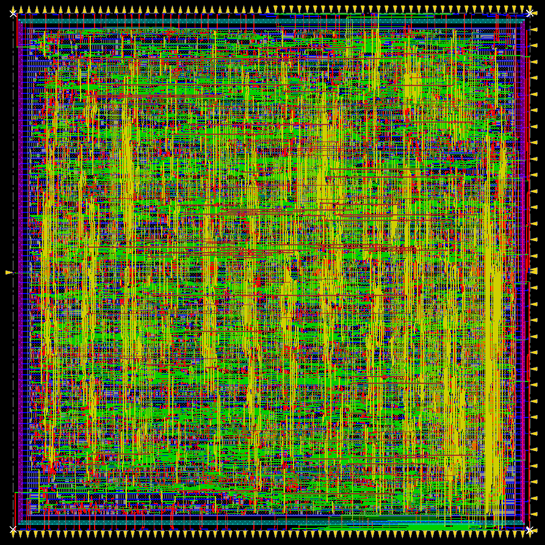
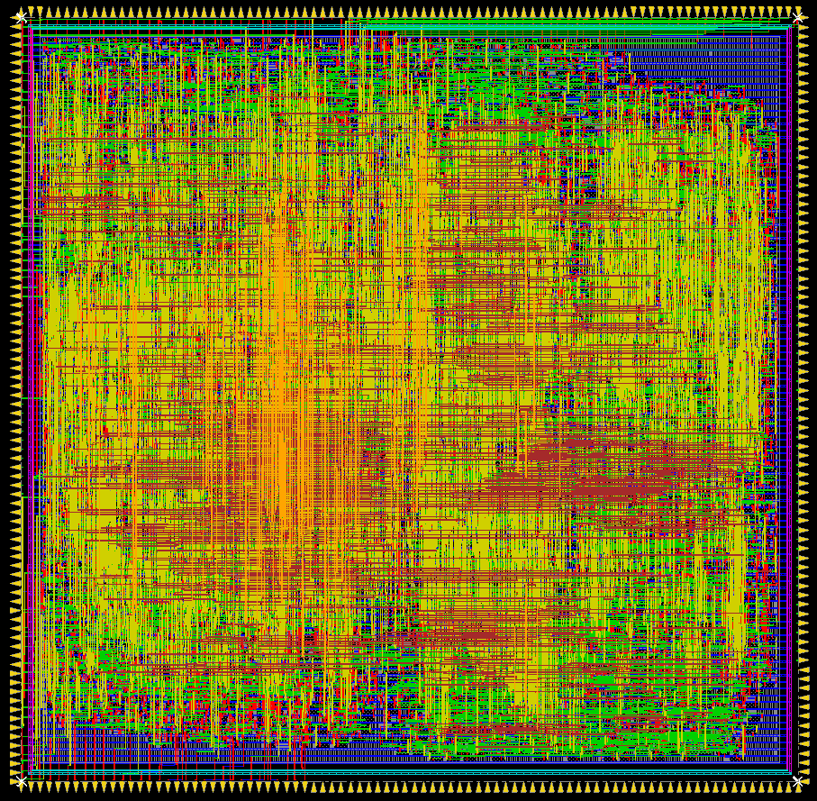
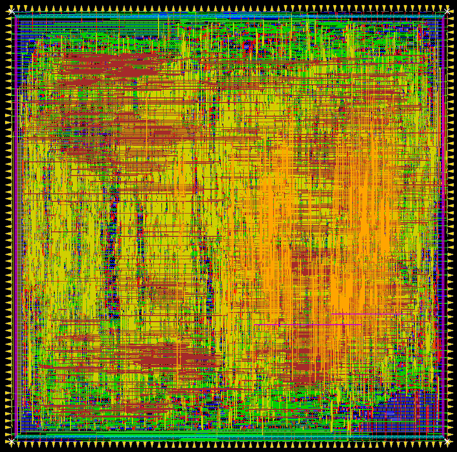
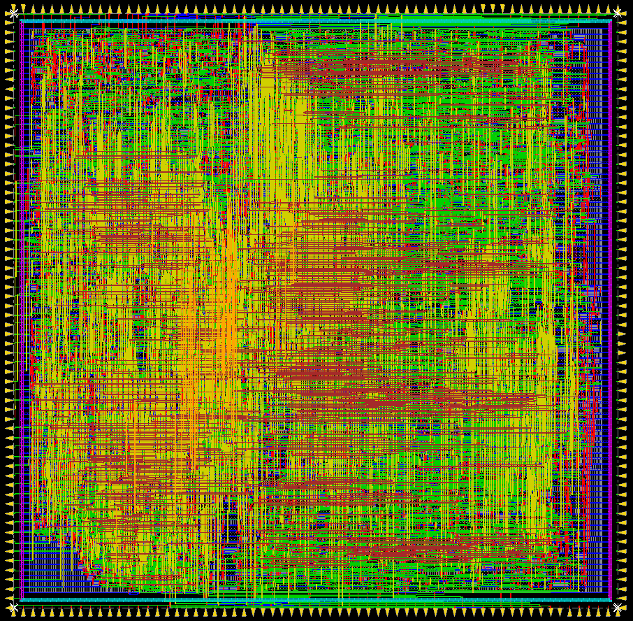
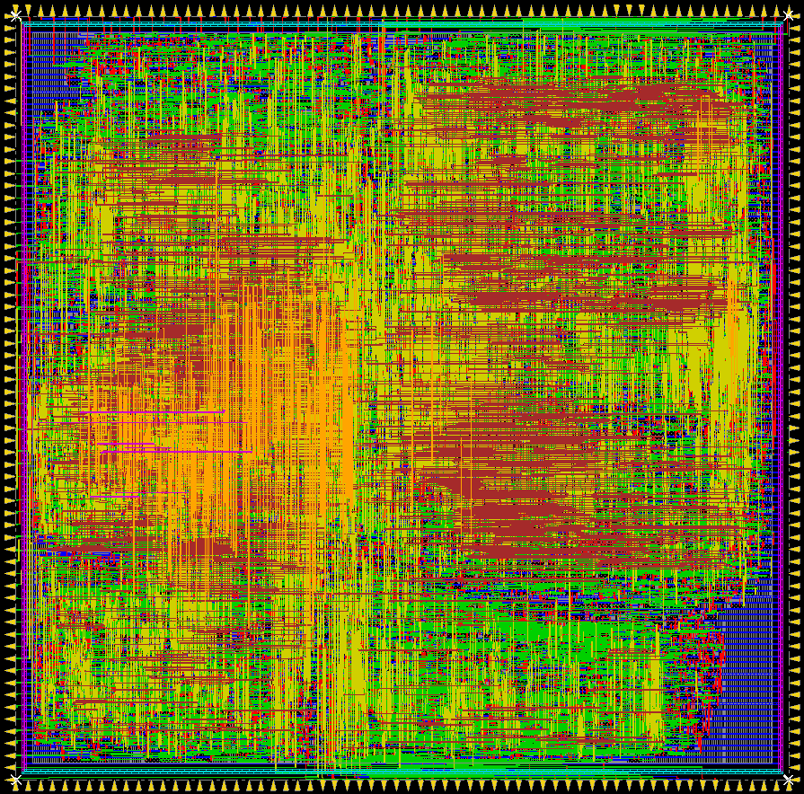
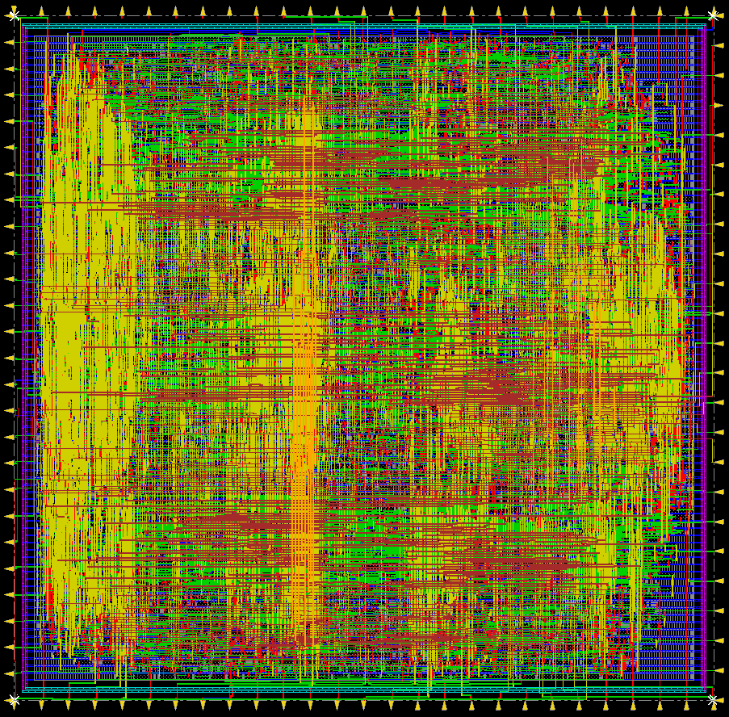

# ASIC roundup of open source RISC-V CPU cores

_2022/01/18 Oguz Meteer // guztech_

---

While waiting for simulation results for my final paper, I thought I'd synthesize and do place & route of several open source [RISC-V](https://riscv.org/) CPU cores for fun. Some basic information:

- All CPU cores were synthesized using a well known 65 nm PDK.
- Synopsys Design Compiler with *ultra* effort was used for synthesis.
- Cadence Innovus was used for place & route.
- A standard I/O template was generated with Innovus with a square floorplan.
- Only the CPU core with the register file and a standardized bus (Wishbone, AXI, AHB, etc.) was taken into account. No full SoCs were used to make the comparisons more fair.

## SERV (RV32I, RV32IM, RV32Zicsr)

The [award-winning](https://riscv.org/blog/2018/12/risc-v-softcpu-contest-highlights/) [SERV](https://github.com/olofk/serv) CPU by [Olof Kindgren](https://twitter.com/OlofKindgren) is a bit-serial RISC-V CPU that is focussed on being as minimal as possible. It may not be the fastest CPU, but it is indeed the smallest RISC-V CPU in this roundup (and possible ever). Here, I used [SERV version 1.1.0](https://github.com/olofk/serv/tree/1.1.0) with the default configuration (rv32i).

- Maximum clock frequency: **1020 MHz**
- Die area: **0.029584 mm^2**

## PicoRV32 (RV32E, RV32I, RV32IC, RV32IM, RV32IMC)

The excellent size-optimized [PicoRV32](https://github.com/YosysHQ/picorv32) CPU by [Claire Xenia Wolf](https://twitter.com/oe1cxw) is not only a very flexible core, but it's also the first formally verified RISC-V CPU! The default configuration was used (RV32I).

- Maximum clock frequency: **806 MHz**
- Die area: **0.0425152 mm^2**

## Minerva (RV32IM)

The [Minerva](https://github.com/minerva-cpu/minerva) CPU by [Lambda Concept](https://twitter.com/LambdaConcept/) is a configurable, 6 stage RISC-V CPU written in [Amaranth HDL](https://github.com/amaranth-lang/amaranth) which is a hardware description language written in Python. The default configuration was used (RV32IM, no I$ / D$).

- Maximum clock frequency: **625 MHz**
- Die area: **0.051076 mm^2**

## (WIP) Hazard3 (RV32I + M, C, A, Zicsr, Zba, Zbb, Zbc, Zbs)

The [Hazard3](https://github.com/Wren6991/Hazard3) CPU core by [Luke Wren](https://twitter.com/wren6991) is a 3-stage RISC-V processor that also supports a bunch of optional extensions. Two different versions were used (both use [hazard3_cpu_1port](https://github.com/Wren6991/Hazard3/blob/master/hdl/hazard3_cpu_1port.v)).

### RV32I
[Configuration](https://gist.github.com/Wren6991/97eb9957c2f1ea9dbfe6fc9942b8fe28)

- Maximum clock frequency: ** MHz**
- Die area: ** mm^2**

### RV32IMZbaZbbZbs

[Configuration](https://gist.github.com/Wren6991/7ec1663234965dd09c94a38d62b59920)

- Maximum clock frequency: ** MHz**
- Die area: ** mm^2**

## (WIP) FemtoRV32 (RV32I, RV32IM, RV32IM, RV32IMC, RV32IMFC)

The [FemtoRV32](https://github.com/BrunoLevy/learn-fpga/tree/master/FemtoRV) CPU core by [Bruno Levy](https://twitter.com/BrunoLevy01) is part of his [learn-fpga](https://github.com/BrunoLevy/learn-fpga) teaching material for FPGAs and processor design. Two different versions were used: [quark](https://github.com/BrunoLevy/learn-fpga/blob/master/FemtoRV/RTL/PROCESSOR/femtorv32_quark.v) (RV32I) and [petitbateau](https://github.com/BrunoLevy/learn-fpga/blob/master/FemtoRV/RTL/PROCESSOR/femtorv32_petitbateau.v) (RV32IMFC)

### Quark

- Maximum clock frequency: ** MHz**
- Die area: ** mm^2**

### Petitbateau

- Maximum clock frequency: ** MHz**
- Die area: ** mm^2**

- - -

If you have questions and/or constructive criticism, let me know on Twitter [@BitlogIT](https://twitter.com/BitlogIT)
