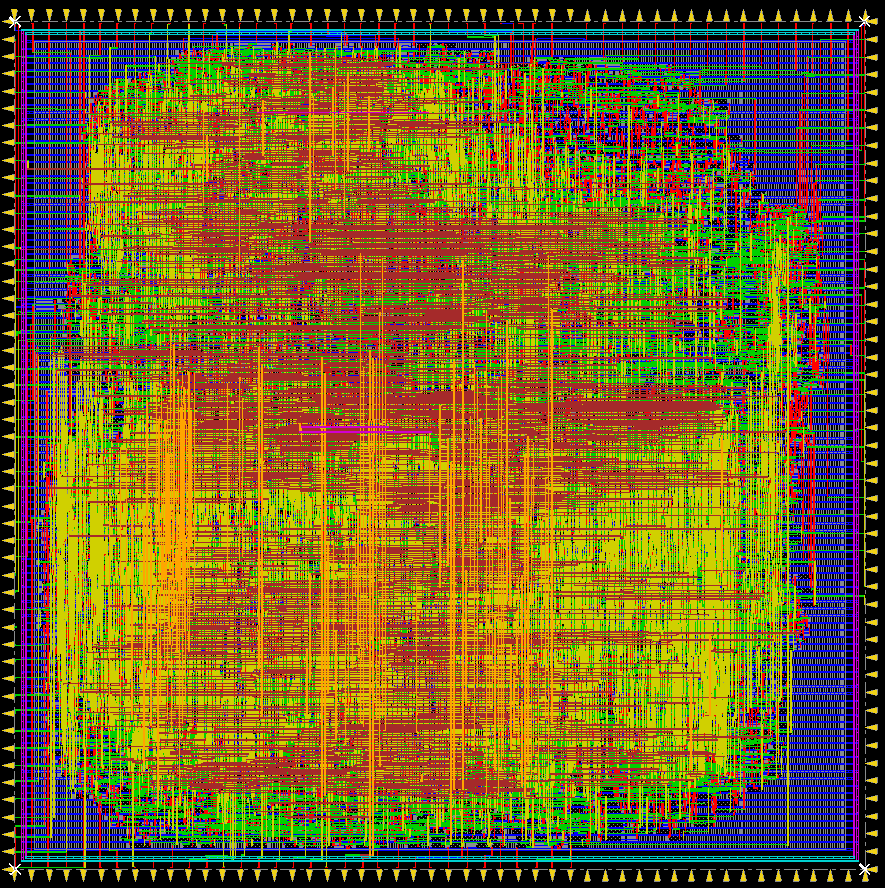

# ASIC roundup of open source RISC-V CPU cores

_2022/01/18 Oguz Meteer // guztech_

---

While waiting for simulation results for my final paper, I thought I'd synthesize and do place & route of several open source [RISC-V](https://riscv.org/) CPU cores for fun. Some basic information:

- All CPU cores were synthesized using a well known 65 nm PDK.
- Synopsys Design Compiler with *ultra* effort was used for synthesis.
- Cadence Innovus was used for place & route.
- A standard I/O template was generated with Innovus with a square floorplan. This means that the area is most likely not used efficiently which will affect the utilization and maximum clock frequency.
- Only the CPU core with the register file and a standardized bus (Wishbone, AXI, AHB, etc.) was taken into account. No full SoCs were used to make the comparisons more fair.
- The goal was maximum clock frequency.

These results are just for fun and to give a very rough estimation of what could be achieved when implemented as an ASIC. There is no SoC, no interconnect, no SRAM, no off-chip memories, etc. so take these results with a mountain of salt. Still, I think it is interesting to see how cores meant to run primarily on FPGAs map onto an ASIC.

Also, since I went for the maximum clock speed, it increases the area quite a bit. To squeeze the last bit of performance out of a design, the usage of buffers shoots up, which increases area and power usage. So this choice negatively impacts cores that are optimized for area in a more disproportionate manner.

# TL;DR

| Core                    | Instruction set | Max. Freq. (MHz) | Die area (mm^2) |
|-------------------------|-----------------|------------------|-----------------|
| SERV                    | RV32I           | 1020             | 0.029584        |
| PicoRV32                | RV32I           | 806              | 0.0425152       |
| Minerva                 | RV32IM          | 625              | 0.051076        |
| Hazard3                 | RV32I           | 435              | 0.037401        |
| Hazard3                 | RV32IMZbaZbbZbs | WIP              | WIP             |
| FemtoRV32 (quark))      | RV32I           | 741              | 0.02964884      |
| FemtoRV32 (petitbateau) | RV32IMFC        | WIP              | WIP             |
| Misato                  | RV32I           | WIP              | WIP             |

## SERV (RV32I, RV32IM, RV32Zicsr)

The [award-winning](https://riscv.org/blog/2018/12/risc-v-softcpu-contest-highlights/) [SERV](https://github.com/olofk/serv) CPU by [Olof Kindgren](https://twitter.com/OlofKindgren) is a bit-serial RISC-V CPU that is focussed on being as minimal as possible. It may not be the fastest CPU, but it is the (barely) smallest RISC-V CPU in this roundup (the other is the [FemtoRV32-quark](#Quark) found further down in this post). Here, I used [SERV version 1.1.0](https://github.com/olofk/serv/tree/1.1.0) with the default configuration (RV32I).

- Maximum clock frequency: **1020 MHz**
- Die area: **0.029584 mm^2**
- Utilization rate: **78.868%**

## PicoRV32 (RV32E, RV32I, RV32IC, RV32IM, RV32IMC)

The excellent size-optimized [PicoRV32](https://github.com/YosysHQ/picorv32) CPU by [Claire Xenia Wolf](https://twitter.com/oe1cxw) is not only a very flexible core, but it's also the first formally verified RISC-V CPU! The default configuration was used (RV32I).

- Maximum clock frequency: **806 MHz**
- Die area: **0.0425152 mm^2**
- Utilization rate: **77.703%**

## Minerva (RV32IM)

The [Minerva](https://github.com/minerva-cpu/minerva) CPU by [Lambda Concept](https://twitter.com/LambdaConcept/) is a configurable, 6 stage RISC-V CPU written in [Amaranth HDL](https://github.com/amaranth-lang/amaranth) which is a hardware description language written in Python. The default configuration was used (RV32IM, no I$ / D$).

- Maximum clock frequency: **625 MHz**
- Die area: **0.051076 mm^2**
- Utilization rate: **80.435%**

## (WIP) Hazard3 (RV32I + M, C, A, Zicsr, Zba, Zbb, Zbc, Zbs)

The [Hazard3](https://github.com/Wren6991/Hazard3) CPU core by [Luke Wren](https://twitter.com/wren6991) is a 3-stage RISC-V processor that also supports a bunch of optional extensions. Two different versions were used (both use [hazard3_cpu_1port](https://github.com/Wren6991/Hazard3/blob/master/hdl/hazard3_cpu_1port.v)).

### RV32I
[Configuration](https://gist.github.com/Wren6991/97eb9957c2f1ea9dbfe6fc9942b8fe28)

- Maximum clock frequency: **435 MHz**
- Die area: **0.037401 mm^2**
- Utilization rate: **75.855%**
- CoreMark/MHz: **1.13**

### RV32IMZbaZbbZbs

[Configuration](https://gist.github.com/Wren6991/7ec1663234965dd09c94a38d62b59920)

- Maximum clock frequency: ** MHz**
- Die area: ** mm^2**
- Utilization rate: **%**
- CoreMark/MHz: **3.02**

## (WIP) FemtoRV32 (RV32I, RV32IM, RV32IM, RV32IMC, RV32IMFC)

The [FemtoRV32](https://github.com/BrunoLevy/learn-fpga/tree/master/FemtoRV) CPU core by [Bruno Levy](https://twitter.com/BrunoLevy01) is part of his [learn-fpga](https://github.com/BrunoLevy/learn-fpga) teaching material for FPGAs and processor design. Two different versions were used: [quark](https://github.com/BrunoLevy/learn-fpga/blob/master/FemtoRV/RTL/PROCESSOR/femtorv32_quark.v) (RV32I) and [petitbateau](https://github.com/BrunoLevy/learn-fpga/blob/master/FemtoRV/RTL/PROCESSOR/femtorv32_petitbateau.v) (RV32IMFC). Important to note is that both versions don't use a standardized interface.

### Quark (RV32I)

- Maximum clock frequency: **741 MHz**
- Die area: **0.02964884 mm^2**
- Utilization rate: **80.173%**

### Petitbateau (RV32IMFC)

- Maximum clock frequency: ** MHz**
- Die area: ** mm^2**
- Utilization rate: **%**

## (WIP) Misato (RV32I)

The [Misato]() core developed by me is written in [Amaranth HDL](https://github.com/amaranth-lang/amaranth) and currently does not use a standardized interface (I am working on adding a Wishbone interface). It is very bare bones, but parts of it are formally verified. Currently, the core does require a single cycle instruction and data memory for it to work correctly. It is a work in progress, but I wanted to include it anyway.

- Maximum clock frequency: ** MHz** 
- Die area: ** mm^2**
- Utilization rate: ** %**

- - -

If you have questions and/or constructive criticism, let me know on Twitter [@BitlogIT](https://twitter.com/BitlogIT)
